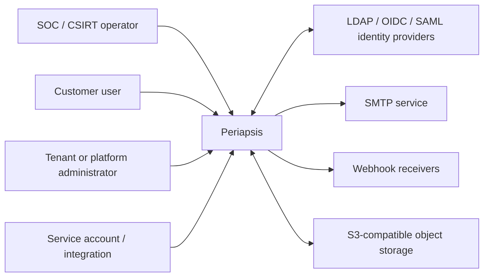
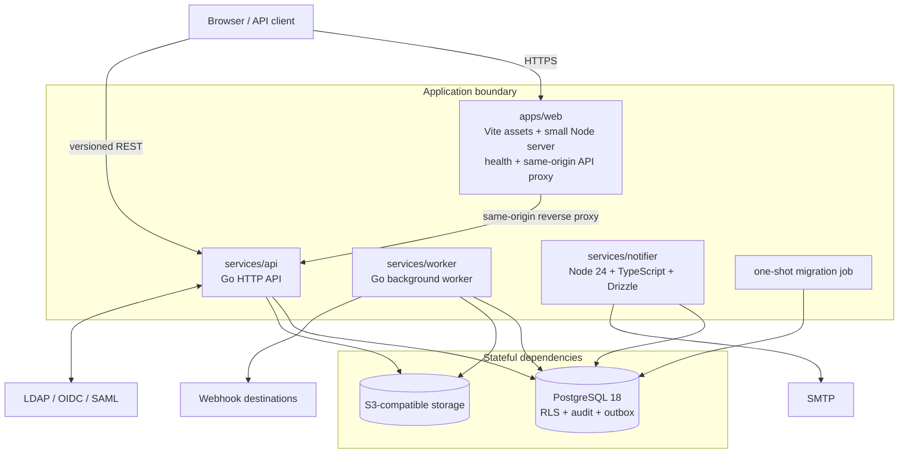

# Periapsis Incident Management Platform — Architecture

Status: repository architecture implemented; candidate gates and external evidence in verification
Last updated: 2026-09-02

## 1. Purpose and delivery status

Periapsis is a self-hosted, multi-tenant Incident Management and DFIR platform for SOC,
MSSP, and CSIRT teams. It manages Alerts and Cases as separate ticket aggregates and
supports investigation artifacts, configurable workflows and SLA, federated identity,
granular authorization, notifications, webhooks, and tamper-evident audit records.

This document describes the implemented repository architecture. The source contains
tenant/platform authorization and administration, local/LDAP/OIDC/SAML identity, MFA and
step-up, Alert/Case workflows, DFIR, SLA actions, notifications/webhooks, bulk/export
workers, audit operations, observability, and orchestrator definitions. The intended
security invariant spans contract, use case, persistence, background consumer, customer
projection, and UI; the focused proof and any unverified end-to-end boundary for each
scenario are recorded in [release-acceptance.md](release-acceptance.md).

The product is original. No code, UI, text, assets, trademarks, or proprietary structure
from IRIS DFIR are used.

## 2. Architectural principles

1. **Modular monolith first.** Domain modules live in a Go codebase with explicit
   boundaries. The API and background worker are separate processes built from those
   modules; independent services are introduced only for a demonstrated operational or
   security boundary.
2. **Defense in depth for tenancy.** Tenant membership and authorization are checked in
   the application, and PostgreSQL Row-Level Security (RLS) is a mandatory second line of
   defense. Neither layer substitutes for the other.
3. **Deny by default.** Every backend use case and endpoint requires an explicit
   permission and scope. Hiding a UI control is never an authorization decision.
4. **Single sources of truth.** Drizzle is the canonical PostgreSQL schema definition;
   committed migrations are generated from it. OpenAPI 3.1 is the canonical HTTP API
   contract. Generated Go and TypeScript artifacts may not be edited by hand.
5. **Transactional consistency.** A domain mutation, its security audit record, domain
   activity, and required outbox events commit together or not at all.
6. **Reliable asynchronous work.** PostgreSQL is the initial durable queue. Consumers
   use leases/row locks, retry safely, and are idempotent; delivery is at least once.
7. **Least privilege everywhere.** Runtime database roles, containers, service accounts,
   object-storage credentials, and deployment identities receive only required access.
8. **Secure extension, not arbitrary code.** Workflows, SLA rules, notification rules,
   and templates use validated, sandboxed declarative languages. User-supplied
   JavaScript, SQL, filesystem access, network access, and process execution are denied.
9. **Observable without exposing secrets.** Structured logs, metrics, and traces correlate
   work across processes while redacting tokens, assertions, credentials, private
   comments, and sensitive payloads.
10. **Vertical slices over placeholders.** No fake production endpoints or critical TODOs
    are accepted. Contracts are added with the implementation and its tests.

## 3. System context



Trust is not transitive. An authenticated identity is not automatically authorized for a
tenant or resource. IdP claims are mapped through configured, audited rules. SMTP,
webhook targets, and object storage are external trust boundaries and receive only
tenant-filtered, purpose-specific data.

## 4. Runtime architecture



### 4.1 Web application

`apps/web` is a React/Vite application built with TypeScript, shadcn/ui, Tailwind CSS,
React Router, TanStack Query/Table, React Hook Form, and Zod. Base visual components live
in `packages/ui`; domain components compose them instead of creating a parallel design
system.

The production image contains a small non-root Node server which serves immutable assets,
exposes liveness/readiness, reads runtime-safe public configuration, and proxies API calls
same-origin. It contains no authorization logic. The generated TypeScript client is the
only normal transport client and is derived from OpenAPI.

### 4.2 Go API

`services/api` owns synchronous HTTP use cases. Transport handlers perform decoding,
limits, contract validation, authentication hand-off, tenant-context construction, and
response mapping. They do not contain domain or SQL logic.

For each request the API:

1. establishes request and correlation IDs and a bounded context with cancellation;
2. authenticates the session, API key, or service account;
3. resolves the tenant only from the path plus server-side identity grants;
4. checks permission, scope, team assignment, resource visibility, and workflow policy;
5. begins a database transaction and installs transaction-local tenant/actor context;
6. invokes an application use case and parameterized/generated queries;
7. commits the mutation, activity, audit, and outbox records atomically;
8. returns a versioned representation or RFC 9457-style Problem Details response.

### 4.3 Go worker

`services/worker` executes domain background work that belongs with the Go application:
SLA evaluation and materialization, scheduled identity synchronization, exports, webhook
delivery, retention, object-scan orchestration, and other durable jobs. Jobs are claimed
concurrently using `FOR UPDATE SKIP LOCKED` or an advisory lock where a singleton is
required. Every job carries explicit tenant context and an idempotency key.

### 4.4 Node notifier

`services/notifier` is a deliberately small Node.js process because Drizzle ORM must be
used at runtime. It consumes notification jobs from PostgreSQL, constructs a
recipient-specific visibility-safe template context, renders sandboxed HTML/plaintext,
sanitizes content, sends SMTP messages, and records attempts, delivery, retry, and
dead-letter outcomes. It exposes no public administrative API.

### 4.5 Migration job

Schema migrations run once through the official `db:migrate` job and dedicated database
role. The runner reserves one database connection and holds a session advisory lock on
that same connection for the complete migration protocol. API, worker, web, and notifier
replicas never migrate automatically at startup. A deployment must not advance its
rollout unless the migration job completes successfully.

While holding the lock, the runner first verifies every packaged migration filename,
journal timestamp, and SQL hash against the generated, repository-owned external manifest.
It then reads the existing Drizzle journal in exact `(created_at, id)` order and verifies
that every applied timestamp and hash is the corresponding manifest prefix entry. These
preflights run before Drizzle executes any migration SQL. A stale bundle or a newer,
reordered, or divergent database journal aborts without applying migrations. After Drizzle
succeeds, a migrator-only seal operation attaches the manifest's full trusted fingerprint
to the explicitly allowlisted immediate-predecessor projection before the runner releases
the lock. Invoking the raw Drizzle migrator bypasses this protocol and is unsupported
outside explicit staged or negative migration tests.

The API and worker compare the applied migration count, latest journal timestamp, latest
migration hash, and ordered journal fingerprint with a manifest generated into each binary
from the committed Drizzle migration journal. Runtime roles cannot read the journal
directly; they can only execute migrator-owned compatibility projections. Missing,
empty, stale, divergent, and newer-than-supported migration states fail readiness closed.
Starting with the v6 ABI, each ordered fingerprint entry binds both values as
`<created_at>@<lowercase SQL SHA-256>`, so an interior timestamp change cannot retain current
readiness merely by preserving hash order and the latest row.

Forward migrations that intentionally preserve the preceding database ABI add one
versioned current projection and may retain one narrowly allowlisted, sealed predecessor
projection. The 0025 transition did this for the exact 25-to-26 journal edge. Its legacy
`app.schema_compatibility()` projection starts with an `UNSEALED` fingerprint; only the
post-migration seal from the trusted runner authorizes it to expose the unchanged
0000-0024 prefix to old replicas. With the intact 26-row journal, an unsealed function or a
runner crash before sealing returns the real 26-row state and leaves old replicas unready.
New replicas still verify all 26 real journal entries through
`app.schema_compatibility_v2()`; the legacy seal is deliberately not a system-wide or v2
readiness gate. The 0025 fallback still proxied the real journal outside its allowlisted
branch, however, so truncating the final journal row could reproduce the released 25-row
manifest even though the 0025 schema remained installed.

Migration 0026 retires v1 with a forward-only impossible sentinel and rotates current
readiness to `app.schema_compatibility_v3()`, which exposes all 27 real journal entries. It
redefines v2 as the exact sealed 26-to-27 predecessor edge: v2 exposes the verified
hash-only 0000-0025 fingerprint expected by old binaries only while v3 reports the complete
27-row timestamp-bound journal and its fingerprint matches the trusted post-migration seal.
An unsealed, truncated, timestamp-drifted, hash-drifted, or additional journal makes v2
return the impossible sentinel.

Migration 0029 rotates current readiness to `app.schema_compatibility_v4()` for the complete
30-row journal. It exposes the exact timestamp-bound 27-row v3 manifest only after the
canonical runner seals that complete journal, and explicitly retires the two-release-old v2
probe with an impossible sentinel. Raw migration, journal truncation, interior timestamp or
hash drift, and extra rows therefore keep both the current binary and every unsupported
predecessor unready.

Migration 0032 rotates current readiness to `app.schema_compatibility_v5()` for the complete
33-row journal. It exposes the exact timestamp-bound 30-row v4 manifest only after the
canonical runner seals that complete journal and replaces v3 with an impossible sentinel.
This is the single supported 30-to-33 rolling edge for the operator-team hardening release.

Migrations 0038 and 0039 rotate current readiness to
`app.schema_compatibility_v6()` for the complete 40-row service-principal journal. V5
exposes the exact sealed 33-row predecessor only while v6 matches the canonical manifest;
v4 remains retired. Migration 0039 is a forward-only repair that records the identifiers
and prior/result versions of expired machine-role grants superseded by a new manual grant.
API and worker readiness for that release queried v6, so extra, missing, reordered, or
hash-drifted journal rows failed closed while the immediately preceding release retained
its sealed v5 view.

Later slices continue the same versioned pattern through the current migration journal.
The authoritative root is the exact function named by the API and worker health checks and
generated compatibility manifest; release prose must not pin a superseded version. Each root
attests its complete journal plus the source/catalog/ACL shape of every independently owned
runtime dependency needed by that binary. Historical functions may remain as immutable
catalog evidence but are not runtime escape hatches and receive no application execution
grant unless a migration explicitly advertises that immediate predecessor.

An incompatible handoff uses an externally quiesced writer boundary. Supported
API/worker/notifier login roles are changed to `NOLOGIN`, every residual backend is drained,
and the migration attests both facts before taking non-waiting writer locks. The migration
transaction commits before the canonical runner invokes its separate seal operation. During
that bounded interval the new root still carries `UNSEALED`, current replicas fail readiness
closed, and unsupported predecessors have no executable projection. This is not a
zero-downtime guarantee; a seal failure aborts the rollout.

Deleting only the 0026 journal row while its SQL remains installed therefore makes v3
report the incomplete 26-row state, which current replicas reject, and makes sealed v2
return the sentinel instead of reproducing the released 26-row manifest. Deleting an
earlier row likewise fails both current and predecessor readiness. New compatibility
edges require an explicit reviewed migration and a new versioned current projection;
readiness never accepts an arbitrary newer or truncated prefix.

Migration execution and teardown errors are retained together rather than allowing advisory
unlock, client shutdown, journal restoration, or staged-directory cleanup to overwrite the
primary failure being diagnosed.

### 4.6 Toolchain baselines and dependency admission

The implemented toolchain baseline is Go 1.26.x at the latest compatible security patch,
Node.js 24 LTS, TypeScript 7, Vite 8 (preferably the compatible 8.2.x line), React at the
latest stable version compatible with that toolchain, pnpm workspaces, PostgreSQL 18,
pgx/sqlc, and Drizzle/Drizzle Kit. Go 1.27 may replace 1.26 only after all dependencies,
generators, CI, and deployment images are verified and the change is recorded in a new
ADR.

Before adding a dependency, maintainers verify that the package and requested version
exist, are actively maintained, are compatible with the pinned toolchain and licenses,
and do not duplicate an existing capability without cause. Direct and transitive versions
are locked reproducibly and included in vulnerability scanning and the SBOM.

## 5. Modular monolith boundaries

The Go code is partitioned by business capability. Each module owns domain types,
application services, repository interfaces, PostgreSQL adapters, transport mapping,
authorization policy, and focused unit/integration tests. Cross-module calls go through
application interfaces or domain events, not another module's tables or internal package.

| Capability group    | Modules                                                                         | Primary responsibility                                                     |
| ------------------- | ------------------------------------------------------------------------------- | -------------------------------------------------------------------------- |
| Platform            | tenancy, users, customer contacts, configuration                                | Tenant lifecycle, profiles, branding, locale, retention                    |
| Identity and access | identity, authentication, authorization, tenant security groups, operator teams | Providers, sessions, MFA, mappings, RBAC and scoped grants                 |
| Incident work       | alerts, cases, comments, activities                                             | Ticket lifecycle, assignment, claim, transition, escalation and visibility |
| DFIR                | IOC, assets, evidence, timeline, tasks, attachments, relationships              | Investigation data, object metadata, custody and typed links               |
| Extensibility       | custom fields, workflows                                                        | Versioned declarative definitions and validated values                     |
| Time commitments    | SLA, business calendars                                                         | Policy matching, timers, materialized deadlines, triggers and overrides    |
| Integration         | notifications, webhooks, reporting, search                                      | Safe projections, asynchronous delivery, exports and full-text search      |
| Accountability      | audit                                                                           | Append-only, redacted, tamper-evident security events                      |

Alert and Case remain independent aggregate roots. Their many-to-many link records the
escalation or correlation provenance; converting an Alert never mutates it into a Case.

## 6. Data architecture

PostgreSQL 18 is the transactional system of record. The initial deployment uses a shared
database and shared schema. Tenant-owned tables have `tenant_id UUID NOT NULL`, forced
RLS, tenant-leading indexes, and tenant-consistent foreign keys. Pure platform catalog
tables are physically separated from tenant-owned tables and are accessible only through
platform use cases.

Data conventions:

- UUIDv7 identifiers generated by an approved library or PostgreSQL facility;
- `timestamptz` for instants, stored and exchanged in UTC;
- IANA time zones retained for display and business-calendar calculations;
- native `inet`, `cidr`, and `macaddr` where their semantics fit;
- JSONB only for bounded, validated flexible payloads such as raw alert input,
  enrichment, immutable snapshots, or versioned event envelopes;
- PostgreSQL full-text search with tenant-scoped indexes and filtered projections;
- typed custom-field storage where values must be filterable or sortable;
- optimistic lock versions and atomic compare-and-update for mutable aggregates;
- separate runtime roles for migration, API, worker, notifier, and audit/read-only access.

Large files are never stored as `bytea`. Attachments and evidence use S3-compatible
storage. The database retains tenant, object key, server-detected MIME type, size,
SHA-256, classification, scan state, actor, timestamps, retention/legal hold, and evidence
chain of custody. Object keys are tenant-prefixed, but the prefix is not authorization:
each upload/download is authorized before issuing a short-lived pre-signed URL.
The initial upload ceremony uses one S3-compatible `PutObject` and caps the
exact object size at 5,000,000,000 bytes before pending metadata is created.
Larger objects require a distinct multipart contract, matching the
[Amazon S3 upload boundary](https://docs.aws.amazon.com/AmazonS3/latest/userguide/upload-objects.html)
instead of treating one pre-signed PUT as a multipart upload.

The detailed conceptual model is in [domain-model.md](domain-model.md) and the conceptual
ERD is in [erd.md](erd.md).

Phase 2B.2 keeps two provenance dimensions independent. Authority path records whether a
role reaches a tenant membership directly or through a `TenantSecurityGroup`; source origin
records which protected manual, migration, or provider/mapping workflow owns each stored
edge. Authoritative reconciliation may modify only its own source-qualified rows, while
additive reconciliation never removes absent authority. A group membership or role-binding
change is authorized against every resulting role policy and lifetime, not only a generic
group-management action. Tenant security groups have no nested local groups in Phase
2B.2a, and group-derived administrators never count as recovery administrators.

An `OperatorTeam` is instead a global platform-owned identity. Phase 2B.2b requires a
tenant-owned assignment epoch plus an exact-epoch roster entry linked to an active tenant
membership before `operator_team` scope can match. Reactivation creates a new epoch so old
rosters cannot revive. Team identity lifecycle is platform-audited; assignment and roster
effects are tenant-audited, and cross-boundary commands produce correlated records in both
streams. These paths are live only through the protected application/database functions;
direct table access and incomplete relationship contexts remain denied.

The database caps each membership at 200 potentially live exact team epochs, collapsing
duplicate source provenance and excluding reversible principal lifecycle gates from the
count. Insert, refresh, unrevocation, and reassignment paths serialize on the tenant
authorization state. Assignment end aggregates consequences by the bounded permission
catalog rather than roster size. Team and assignment versions are representation-bound:
assignment start/end advances the team representation, and team display-name/archive
changes advance nested assignment representations. Expired platform and tenant replay
commands are removed only by independently bounded worker batches.

## 7. Tenant and authorization request flow

```mermaid
sequenceDiagram
    participant C as Client
    participant A as API
    participant Z as Authorization policy
    participant D as PostgreSQL

    C->>A: request /api/v1/tenants/{tenantId}/cases/{caseId}
    A->>A: authenticate and validate input
    A->>Z: actor + token scopes + path tenant + action
        Z->>Z: membership + authority paths + exact team epoch + object visibility
    alt denied or ambiguous
        Z-->>A: deny
        A-->>C: 403/404 Problem Details
    else allowed
        A->>D: BEGIN; SET LOCAL tenant and actor context
        D->>D: forced RLS + tenant-consistent predicates
        D-->>A: tenant-filtered result
        A->>D: COMMIT
        A-->>C: response
    end
```

Customer users cannot choose a tenant through a header. Multi-tenant operators may select
only an assigned tenant, and the active tenant is always visible in the UI. A platform
super-admin enters an explicit, reason-bearing access action and operates with one tenant
context at a time; the access itself is audited. General API connections do not have
`BYPASSRLS`.

## 8. API and contract architecture

All public APIs live below `/api/v1`. Tenant resources use
`/api/v1/tenants/{tenantId}/...`; platform resources use `/api/v1/platform/...` and
separate authorization policies. Important commands such as claim, transition, transfer,
escalate, link, close, reopen, and SLA override are explicit actions rather than generic
patches.

OpenAPI 3.1 defines paths, schemas, error responses, security requirements, pagination,
filters, examples, and idempotency headers. The API conventions are:

- RFC 9457-compatible Problem Details with stable application error codes;
- request ID and correlation ID propagation;
- cursor pagination and deterministic sorting;
- server-side validation, field allowlists, and payload limits;
- ISO 8601 UTC timestamps;
- optimistic concurrency through ETag/`If-Match` or an explicit version;
- `Idempotency-Key` for creates and commands that may be retried;
- asynchronous bulk operations and exports;
- controlled `include`/field selection that re-applies visibility policy;
- documented versioning, deprecation, and backward-compatibility rules.

Swagger UI at `/docs` and `/openapi.json` are configurable in production; disabling the
interactive UI never disables the canonical contract artifact.

## 9. Consistency, events, and concurrency

Use cases that cross aggregates use an explicit transaction. The minimal write envelope
is:

```text
domain state + domain activity + security audit + outbox event(s)
```

Claims are conditional writes. An Alert or Case can be claimed only when its tenant,
workflow state, current assignment, expected version, actor permission, and team access
all match. Exactly one concurrent claimant commits; others receive a conflict and no
partial audit/outbox record.

Alert-to-Case escalation uses an idempotency record and optimistic versions. Case creation,
selected data copies, the Alert/Case link with provenance, audit, and outbox events commit
together. Private comments are excluded by policy before a customer-safe projection or
event payload is constructed.

The outbox provides at-least-once delivery, not fictional exactly-once delivery.
Consumers persist idempotency/deduplication keys and tolerate replay. Ordering is only
guaranteed where explicitly required, normally per aggregate or delivery stream.

## 10. Authentication and secret boundaries

LDAP, OIDC Authorization Code with PKCE, and SAML 2.0 use mature protocol libraries.
Provider attributes and groups are normalized and mapped through priority-ordered,
audited rules. Mappings cannot grant `platform_super_admin` without a separate privileged
configuration action. JIT provisioning and authoritative synchronization apply their
membership changes in one transaction. Reconciliation plans carry an exact source owner,
evaluate all prospective role consequences, and may not adopt, update, or revoke manual or
another source's authorization edges. Provider claims are mapping input, not authority.

Break-glass local accounts are bootstrap/emergency-only, disableable, protected by
memory-hard password hashing and mandatory MFA. TOTP, WebAuthn/passkeys, one-use hashed
recovery codes, step-up, session rotation/revocation, inactivity and absolute expiry,
CSRF protection, secure cookies, and rate limits are enforced according to platform and
tenant policy.

Application secrets are encrypted with a master key supplied outside the repository.
Docker/Kubernetes file-based secrets are supported. Saved provider secrets are never
returned to the UI, and logs/traces/audit diffs redact credentials, tokens, assertions,
recovery codes, API keys, and email bodies.

## 11. Deployment and operations

Every application image is multi-stage, immutable, non-root with a numeric UID/GID, and
listens on an unprivileged port. Images support a read-only root filesystem, explicit
temporary storage, dropped capabilities, no privilege escalation, health probes, and
graceful shutdown. Go final images omit a shell where practical. No secret is copied into
an image layer.

The same images target:

- Docker Compose for local development (PostgreSQL, OpenLDAP, test OIDC/SAML IdP,
  Mailpit-compatible SMTP, MinIO, and a one-shot migration job);
- Docker Swarm with external secrets/configs, overlay separation, rolling update and
  rollback policy;
- Kubernetes/Kustomize with service accounts, probes, resource controls, network policy,
  HPA/PDB, `RuntimeDefault` seccomp, and external PostgreSQL/S3 configuration.

Production should use managed/external PostgreSQL and S3-compatible storage where
appropriate. Migrations remain an explicit deployment step.

## 12. Observability

API, worker, notifier, and web server emit structured JSON logs with request, correlation,
trace, tenant-safe, actor-safe, and job identifiers. OpenTelemetry spans cover API to
database to outbox to consumer; Prometheus metrics cover latency, errors, auth failures,
queue age/depth, retries/dead letters, SLA state, and notification outcomes.

Cardinality and privacy budgets are enforced: raw IOC values, full email addresses,
tokens, SAML assertions, LDAP attributes, private comments, raw alert payloads, evidence
names, and rendered email bodies are not metric labels or routine log fields.

## 13. Non-negotiable security invariants

These invariants are release gates, not backlog aspirations:

1. Every tenant-owned row has a non-null tenant ID and is protected by forced RLS.
2. Every tenant request has explicit server-derived tenant context; missing or mismatched
   context fails closed.
3. Every operation is authorized in the backend with permission, scope, membership/team,
   workflow, and visibility checks appropriate to the action.
4. Runtime database roles cannot bypass RLS or mutate/delete audit events.
5. Tenant identity is propagated into jobs, search, export, audit, object access,
   notifications, and webhooks; it is never inferred from payload data alone.
6. Private comments and operator-only fields are removed before customer API, UI, email,
   export, search, or webhook projections are built.
7. Mutation, activity, audit, and required outbox writes are atomic.
8. Claim, deduplication, escalation, transition, and retry paths are concurrency-safe and
   idempotent where clients or workers may repeat them.
9. Evidence downloads and pre-signed URLs require a fresh authorization check; object
   location is not proof of access.
10. User expressions and templates cannot execute arbitrary code, SQL, network calls,
    filesystem calls, or processes.
11. No custom cryptographic primitive or protocol implementation is permitted.
12. Secrets never enter source control, generated clients, images, routine logs, or API
    responses after creation.
13. Production containers run non-root with least privilege and a read-only filesystem
    contract.
14. Schema and API generated artifacts must match their canonical sources in CI.

The initial threat analysis and required verification are in
[threat-model.md](threat-model.md).

## 14. Implemented delivery sequence and release gates

The phases below describe construction order. Their repository slices are present; the
candidate still requires the retained external evidence identified in
[release-acceptance.md](release-acceptance.md).

| Phase                      | Complete vertical outcome                                                                                     | Mandatory gate before advancing                                                                                              |
| -------------------------- | ------------------------------------------------------------------------------------------------------------- | ---------------------------------------------------------------------------------------------------------------------------- |
| 0 — Architecture/bootstrap | Repository conventions, decisions, workspace, minimum CI and local composition                                | Documentation is internally consistent; bootstrap commands run; no fake production capability is advertised                  |
| 1 — Database/tenancy       | Canonical schema, migrations, tenants, users/membership, base audit/outbox, demo seed                         | Clean and upgrade migration tests; schema drift; RLS and direct-ID cross-tenant tests; generated Go queries compile          |
| 2 — Auth/RBAC              | Sessions, break-glass, LDAP/OIDC/SAML, MFA, groups, roles, teams, permission enforcement                      | Protocol validation, mapping dry-run parity, revocation, RBAC matrix, CSRF/session/rate-limit and privilege-escalation tests |
| 3 — Alerts/Cases           | API and UI for lifecycle, claim, assignment, escalation, comments, activity, audit                            | OpenAPI/client drift, E2E workflows, claim race, idempotent escalation, private-comment non-disclosure tests                 |
| 4 — Custom fields/DFIR     | Dynamic typed fields and IOC, asset, evidence, timeline, tasks, attachments, relationships                    | Type/visibility validation, object authorization, malware-scan state and chain-of-custody tests                              |
| 5 — SLA                    | Versioned policies/calendars, materialized metrics, worker, triggers, override and simulator                  | DST/time-zone/holiday tests, replay/idempotency tests, no-loop system-alert tests                                            |
| 6 — Notifications          | Rule engine, PostgreSQL queue, Node notifier, safe templates, SMTP and delivery history                       | Sandbox/sanitization, tenant/visibility, retry/dead-letter and recipient idempotency tests                                   |
| 7 — Hardening/deployment   | Non-root images, Compose/Swarm/Kubernetes, observability, backup/restore, performance and security automation | Full CI, SBOM, secret/dependency/container scans, manifest validation, restore drill, security and performance baselines     |

Every phase has formatter/linter, TypeScript, Go, Node, schema/OpenAPI drift,
integration/security, and build gates relevant to its boundaries. Deployment hardening
deepens assurance; it does not postpone foundational security controls.

## 15. Decision records

- [ADR-0001: Modular monolith](adr/0001-modular-monolith.md)
- [ADR-0002: Tenant isolation](adr/0002-tenant-isolation.md)
- [ADR-0003: Contract and schema sources](adr/0003-contract-and-schema-sources.md)
- [ADR-0004: PostgreSQL transactional outbox](adr/0004-postgresql-outbox.md)
- [ADR-0005: Local bootstrap and session security](adr/0005-local-bootstrap-and-session-security.md)
- [ADR-0006: Tenant RBAC, delegation, and service principals](adr/0006-tenant-rbac-delegation-and-service-principals.md)
- [ADR-0007: Tenant security groups and operator-team assignment epochs](adr/0007-tenant-security-groups-and-operator-team-epochs.md)
- [ADR-0008: Service principals and idempotent Alert ingest](adr/0008-service-principals-and-idempotent-alert-ingest.md)
- [ADR-0009: LDAP identity and source-owned reconciliation](adr/0009-ldap-identity-providers-and-source-owned-reconciliation.md)
- [ADR-0010: Federated SSO and MFA assurance](adr/0010-federated-sso-mfa-and-session-assurance.md)

Architectural changes that alter a trust boundary, source of truth, deployment unit,
tenant model, consistency guarantee, or external dependency require a new ADR.
