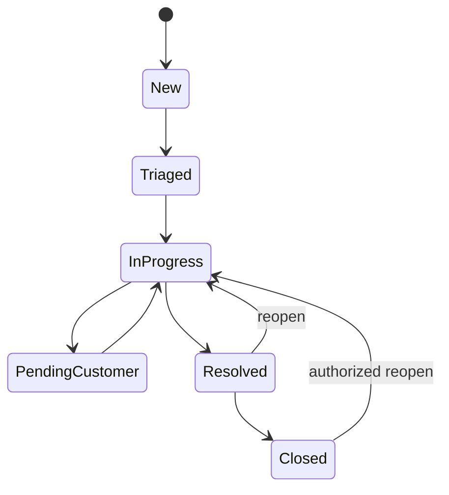

# Periapsis Domain Model

Status: release-candidate domain boundaries implemented
Last updated: 2026-09-02

## 1. Purpose

This document defines the shared language, aggregate boundaries, ownership rules, and
business invariants for Periapsis. It is intentionally independent of transport and UI.
The canonical physical database schema is defined through Drizzle and committed migrations;
the canonical HTTP representation is OpenAPI 3.1. Tenant/platform identity and authority,
Alert/Case, workflow, custom-field, DFIR, SLA, notification/webhook, bulk/export,
audit/retention, tenant settings, and platform operations have physical implementations.
This document explains their aggregate boundaries but does not replace either canonical
source. A concept is release-complete only when persistence, backend policy, API, UI where
applicable, audit/outbox effects, focused tests, and the required external evidence all
agree; see [release-acceptance.md](release-acceptance.md).

## 2. Ubiquitous language

| Term                  | Meaning                                                                                                                 |
| --------------------- | ----------------------------------------------------------------------------------------------------------------------- |
| Tenant                | A customer security boundary with its own configuration, locale, users, contacts, workflows, SLA, and data              |
| User                  | A human platform identity that may authenticate and hold memberships in zero or more tenants                            |
| Customer contact      | A tenant-owned notification recipient; it may exist without an authenticating account and may optionally link to a User |
| Tenant security group | A tenant-owned role-binding group populated manually or by source-owned identity reconciliation; never a platform role  |
| Operator team         | A global platform-owned technical queue that serves a tenant only through an assignment epoch and tenant-scoped roster  |
| Membership            | The explicit grant connecting a User to a Tenant, with status and lifecycle                                             |
| Service account       | A tenant-owned machine principal with no User, human membership, browser session, or human-only administration rights   |
| API credential        | A one-time bearer envelope bound to one service account, a live permission allowlist, optional CIDRs, and an expiry     |
| Permission            | A stable action key such as `case.claim`; permissions are evaluated with a scope                                        |
| Role                  | A named set of permissions. Tenant roles may be customized only within the administrator's grant ceiling                |
| Alert                 | An independent aggregate representing an observed signal requiring triage                                               |
| Case                  | An independent aggregate representing an investigation or incident response engagement                                  |
| Claim                 | An atomic command by which one authorized operator becomes responsible for an eligible Alert or Case                    |
| Activity              | User-facing domain history explaining what happened to a work item                                                      |
| Audit event           | Append-only security/accountability evidence with richer context and tamper-evident linkage                             |
| Evidence              | An investigation record whose bytes live in object storage and whose metadata and custody live in PostgreSQL            |
| Workflow              | A versioned declarative state machine for one object type                                                               |
| SLA instance          | A version-pinned application of an SLA policy to a specific Alert, Case, or optionally Task                             |
| Outbox event          | A durable event written in the same transaction as the state change that caused it                                      |

## 3. Context map and ownership

| Context                 | Owns                                                                                           | May reference                                   | Must not do                                                         |
| ----------------------- | ---------------------------------------------------------------------------------------------- | ----------------------------------------------- | ------------------------------------------------------------------- |
| Tenancy                 | Tenant, tenant settings, branding, locale, retention                                           | platform configuration                          | infer tenant from untrusted headers                                 |
| Identity/authentication | User, external identity, provider config, session, MFA device, service account, API credential | tenant membership, role/source authority        | store LDAP/SSO passwords or return saved secrets                    |
| Authorization           | Permission, role, grant, tenant security group, operator-team assignment epoch                 | actor, tenant, resource policy                  | rely on frontend checks or grant above the actor's ceiling          |
| Alerting                | Alert, alert number, assignment history, alert activity                                        | comments, IOC/assets, Case links, workflow, SLA | silently merge duplicate Alerts or turn an Alert row into a Case    |
| Case management         | Case, case number, assignment history, case activity                                           | linked Alerts and DFIR records                  | leak operator-only content into customer projections                |
| Investigation           | IOC, Asset, Evidence, Timeline Event, Task, Attachment, Relationship                           | Alert/Case and object storage                   | treat an object key or URL as authorization                         |
| Workflow/customization  | Workflow definition/version, custom field definition/layout/value                              | Alert/Case transition context                   | execute user JavaScript, SQL, network, filesystem, or process calls |
| SLA                     | Policy/version, calendar/version, metric definition/instance, override                         | domain events, notification trigger             | mutate historical instances when a policy is edited                 |
| Integration             | Notification rule/template/job, webhook, export                                                | visibility-safe domain projections              | consume raw aggregates without recipient policy filtering           |
| Audit                   | Audit event and chain verification                                                             | actor/request/resource identifiers              | expose mutation or deletion to runtime application roles            |

Modules collaborate through application interfaces and versioned domain events. Direct
cross-module table writes are forbidden.

## 4. Tenant and identity model

### 4.1 Tenant

`Tenant` is the root administrative and data-isolation boundary. It owns a stable ID,
display identity, lifecycle state, IANA time zone, locale, branding, retention policy, and
references to versioned configuration.

Invariants:

- tenant-owned entities carry `tenantId` and cannot be re-parented;
- tenant deletion is a controlled lifecycle/retention operation, never a blind cascade;
- tenant configuration changes are permission checked, versioned where behavior can affect
  existing work, and audited;
- a disabled tenant cannot accept new interactive sessions or integration writes;
- global defaults are copied/resolved through explicit configuration precedence and never
  bypass tenant policy.

### 4.2 User, membership, contact, group, and team are distinct

`User` is a platform identity. A `TenantMembership` grants that identity access to one
tenant and records status, provisioning source, activation/revocation times, and applicable
profile. Authentication alone does not create tenant access.

`CustomerContact` is tenant-owned and intended for communication/escalation. It contains
name, email, optional phone, function, language, time zone, escalation priority,
notification categories/windows, tags, and active state. It may link to a User, but a link
does not itself grant membership or permissions.

`TenantSecurityGroup` is a tenant-owned security grouping used by role bindings and, in a
later identity-provider slice, mapping reconciliation. Its membership edge binds a
`TenantMembership`, not a bare User. Phase 2B.2a permits only direct membership edges: no
tenant security group may contain another group and no recursive local membership is
evaluated.

`OperatorTeam` is a global, platform-owned technical work-queue identity. It serves a
tenant only through an explicit tenant-owned assignment epoch and a roster entry tied to
that exact epoch and an active tenant membership. Ending and restoring an assignment
creates a new epoch, so stale roster entries cannot reactivate. Tenant security groups and
operator teams do not collapse into one entity.

An authority path (`direct` or `group`) explains how a role reaches a
principal. Source origin explains which protected manual, migration, or provider workflow
owns and may reconcile each contributing edge. Both group membership and group-role
binding sources remain visible in effective-authority provenance.

Invariants:

- a User sees a tenant only through an active membership or a privileged, explicit,
  audited platform access action;
- a contact without a User never authenticates;
- linking a contact and User does not make private operator content customer-visible;
- team membership alone does not grant tenant access, and tenant membership alone does not
  grant a claim permission;
- creating, extending, or revoking group membership checks every affected live role
  against the actor's exact live delegation ceiling and lifetime;
- group-derived `tenant_admin` authority never satisfies the direct-human recovery
  invariant;
- a global operator-team identity or directory roster grants nothing without a live tenant
  assignment epoch, exact-epoch roster entry, active tenant membership, and the required
  `operator_team` permission;
- identity-provider mappings cannot grant `platform_super_admin` through an ordinary
  tenant mapping;
- authoritative synchronization removes only grants it owns and follows configured grace
  and deprovision policies; additive synchronization never silently removes manual grants.

### 4.3 Authentication providers and sessions

Platform-scoped and tenant-scoped provider records are persisted separately so a
tenant-owned provider always has non-null tenant ownership. Provider secrets are encrypted
using an externally supplied master key and are write-only after storage.

LDAP, OIDC, and SAML external identities attach to a User through an immutable provider
identifier. JIT provisioning, attribute refresh, group resolution, role/team calculation,
and membership changes form one audited transaction. Local break-glass credentials are a
separate emergency method with mandatory MFA.

`Session` records authentication method, assurance/MFA context, absolute and inactivity
expiry, rotation lineage, revocation state, and safe device metadata. Session IDs rotate
after authentication and privilege changes. API credentials are displayed once, stored
only as versioned keyed digests, tenant/permission scoped, expiring, rotatable, revocable,
and optionally CIDR-restricted. Source keys come from the independently versioned external
credential keyring; readiness fails closed unless every live database key version is
available to the replica.

## 5. Authorization model

Authorization is an input to every use case, not a post-processing step.

```text
allow = active identity/session
     AND explicit tenant access
     AND permission(action)
     AND permission scope covers resource
     AND team/assignment rule passes where required
     AND workflow state allows action
     AND field/comment/customer visibility allows representation
     AND token/API-key scope allows action
```

The decision is deny-by-default. Supported scopes are `own`, `assigned`,
`operator_team`, `tenant`, and `platform`. A tenant administrator can create custom roles
only from permissions and scopes the administrator is authorized to delegate. Platform
operations use separate permissions and do not inherit from tenant roles.

Group-derived role authority is the consequence of two tenant-owned edges: an active
membership path and an active group-role binding. A protected mutation evaluates every
resulting role policy and its effective lifetime before either edge is added, restored, or
extended. The path is not a source owner: authoritative reconciliation may update only
rows owned by its exact provider/mapping source, while manual and other-source rows remain
untouched. Group-derived authority does not count as a recovery administrator.

The `operator_team` relationship is live. It requires the resource team, a live tenant
assignment epoch, an active roster entry in that
exact epoch, and an active tenant membership in addition to the scoped permission. Global
team lifecycle uses platform audit; tenant assignment and roster effects use tenant audit,
with correlated events for a command that crosses both boundaries.

Resource reads and writes both apply policy. Search, include/expand, bulk action, export,
notification, webhook, object download, and background jobs use the same policy semantics
as direct resource endpoints.

A service account receives authority only through live service-account role grants. Every
bearer command intersects that current role authority with the credential's exact
permission/scope tuples, account and credential lifecycle, expiry, and optional CIDR
allowlist. No wider scope subsumes a credential tuple. Human-only tenant administration is
structurally unavailable to service accounts, and the first implemented business tuple is
only `alert.create@tenant`.

## 6. Alert aggregate

ADR-0008 introduced the bounded create projection and atomic Alert/activity/audit/outbox/
idempotency write. The complete governed ticketing slices now implement the additional
fields and commands below while preserving that creator and replay boundary.

`Alert` is an autonomous aggregate root. Its core state includes:

- tenant and atomic tenant-specific alert number;
- source, source type, external ID, explicit deduplication key, and optional bounded raw
  payload;
- title, description, status, severity, priority, category, classification, and tags;
- detected, received, acknowledged, closed, created, and updated instants;
- assigned team, assignee, claim actor/time, and customer visibility;
- typed custom-field values and an optimistic lock version.

Commands include create/ingest, triage, acknowledge, assign, transfer, claim, release,
transition, close, reopen, comment, attach, correlate, link, and escalate. Each command
validates tenant, permission/scope, expected version, workflow, required fields, and
visibility before changing state.

Deduplication never silently merges Alerts. A repeated idempotency key returns the prior
result; a matching deduplication key creates an explicit correlation/deduplication outcome
which is visible and audited according to configured policy.

## 7. Case aggregate

`Case` is a separate aggregate root with its own tenant-specific atomic number, lifecycle,
assignment, claim, custom fields, visibility, and optimistic version. It owns investigation
coordination, while IOC, assets, evidence, timeline entries, tasks, attachments, and typed
relationships retain their own identifiers and authorization rules.

The initial configurable number patterns include `ALT-YYYY-NNNNNN` and
`CASE-YYYY-NNNNNN`. Sequence allocation is transactional and unique per tenant, object
type, and configured period.

Illustrative default workflows are bootstrap data, not hardcoded logic:



Published workflow versions define the real states and transitions. Existing objects stay
pinned to their workflow/version unless an authorized, simulated migration is performed.

## 8. Assignment and atomic claim

Alert and Case are tickets that can appear in unassigned, team, and personal queues.
`AssignmentHistory` records every assignment, claim, release, and transfer without
rewriting history.

A claim is a compare-and-update command over tenant, object ID, expected version, current
assignee/claim state, and allowed workflow states. The actor must have tenant membership,
the claim permission/scope, and either membership in an assigned/eligible team or an
explicit override. Exactly one of two competing claims can commit. The losing command
returns a conflict and creates no misleading success activity.

Successful claim/release/transfer commits all of the following atomically:

- aggregate state and optimistic version;
- assignment history;
- domain activity;
- security audit event;
- SLA event or timer change when applicable;
- required outbox event.

## 9. Alert-to-Case escalation and linking

`AlertCaseLink` implements a many-to-many relationship. It stores tenant, Alert and Case,
link time/actor, relation type, escalation reason, source Alert version, and an immutable
snapshot identifying selected copied fields.

Creating a Case from an Alert is an idempotent application command. One transaction:

1. validates tenant, permission, object visibility, workflow, and expected versions;
2. allocates the Case number and creates the Case;
3. copies only explicitly selected and authorized tags, custom fields, IOC, assets,
   attachments, contacts, and public comments;
4. records provenance links instead of obscuring the source;
5. records activity, audit, idempotency result, and outbox events.

Private comments are ineligible for automatic customer-facing copy. Replaying the same
idempotency key returns the original Case and never creates a second one.

## 10. Comments and visibility

`Comment` belongs to exactly one Alert or Case and has `public` or `private` visibility.
Content is sanitized Markdown; arbitrary HTML is rejected. Revision history is retained,
and edit policy is time/role limited.

Invariants:

- customer actors can create only public comments;
- private comments require an operator permission;
- private content and its attachments are removed before customer-safe API, search,
  export, email, webhook, and portal projections are created;
- a notification triggered by a private comment can target only authorized operators;
- mentions do not grant access and cannot notify an unauthorized recipient;
- every create/edit produces activity and audit; history is not silently overwritten.

Visibility is modeled as policy, not merely a boolean serialization filter. Derived
projections are created from allowed fields, never by serializing an aggregate and then
attempting ad hoc redaction.

## 11. DFIR entities

### IOC

An IOC preserves the submitted value and stores a type-specific normalized value for
matching. Supported initial types include IP, domain, hostname, URL, email, common file
hashes, filename, registry key, process, mutex, CVE, and custom. Known types are validated
without mutating the original evidence. Confidence, TLP, malicious state, source,
first/last seen, tags, and validated bounded enrichment are recorded.

### Asset

An Asset records host/network identifiers using suitable native database types, asset
type, OS, owner, business unit, criticality, environment, external ID, tags, observation
times, and bounded custom attributes. Normalization does not erase the reported value.

### Evidence and attachment

`Evidence` owns metadata and custody; `StorageObject` identifies bytes in S3-compatible
storage. A storage object records a server-calculated SHA-256, server-detected MIME, size,
scan state, classification, retention/legal hold, tenant, creator, and times. Evidence adds
collection source, collector/time, and an append-only chain of custody.

An object is not available to download until policy and scan-state rules pass. Each
pre-signed URL is short-lived and issued only after a fresh tenant/resource authorization
check. Legal hold prevents retention deletion.

### Timeline event

A Timeline Event preserves event and ingestion times separately, source time zone and
precision, source, category, title/description, actor, tags, and links to IOC/assets/
evidence. UTC normalization retains original time context for forensic interpretation.

### Task and relationship

A Task has status, priority, assignee/team, due time, checklist, completion data, comments,
and optional SLA linkage. Typed Relationships connect Alert, Case, IOC, Asset, Evidence,
Task, Attachment, and authorized external references. A relationship can never bridge
tenants.

## 12. Custom fields

`CustomFieldDefinition` is tenant-owned, object-type specific, versioned, and identified by
a stable key. It defines data type, validation, options, default, create/detail/list/export
placement, transition requirements, visibility/edit policy, search/filter/sort behavior,
and archival state.

Values distinguish missing, explicit null, and an empty value. They are validated on the
server and stored in typed/indexable form. JSON is allowed only for an explicitly
authorized structured schema. Destructive type changes require a versioned migration with
preview; definitions with existing values cannot simply change type.

Customer projections never receive a hidden definition or value. Bulk import, filtering,
sorting, exports, and generated forms reuse the same definition version and field policy.

## 13. Workflow

`WorkflowDefinition` has immutable published versions per tenant and object type. A version
defines states, initial/terminal states, transitions, authorized roles/permissions,
required fields, declarative conditions/actions, SLA/notification triggers, customer
visibility, reason requirements, and reopen rules.

Drafts can be edited; published versions are immutable. Conditions are parsed, validated,
complexity-bounded, deterministic, and sandboxed. A transition command records the old
state, new state, workflow version, reason, actor, time, activity, audit, and events in one
transaction.

The closed expression grammar, fact vocabulary, resource limits, and three-valued
fail-closed evaluation are specified in [Declarative workflow conditions](workflow-conditions.md).

## 14. SLA model

An `SLAPolicy` has immutable versions and priority-ordered declarative match rules. A
version owns metric definitions such as acknowledge, assignment, first response,
containment, customer update, resolution, and closure. A metric defines its start,
pause/resume, completion/reset conditions, elapsed/business duration, calendar version,
warning/breach thresholds, display, and visibility.

`SLAInstance` pins the chosen policy and calendar versions to one Alert/Case/Task.
`SLAMetricInstance` materializes state, started/due/completed/breached instants, consumed
business seconds, next evaluation, and display values so list pages do not recalculate the
entire history.

Calendars support multiple daily intervals, IANA time zones, holidays, closures,
exceptions, and DST. Overrides require a dedicated permission and reason and preserve
before/after values in audit. Policy changes never alter existing instances unless an
authorized operator previews and explicitly applies a recalculation/migration.

SLA triggers produce idempotent outbox events. A generated system Alert uses source
`sla-engine`, a deduplication key, a link to the origin, and a no-recursion guard.

## 15. Notification and webhook model

`NotificationRule` is tenant-owned and versioned. It matches a versioned event and selects
authorized recipients, template/version, channel, priority, quiet hours, delay,
deduplication/grouping, and retry policy. Recipient resolution is tenant constrained and
captures the policy decision used for delivery.

`NotificationTemplate` has subject, HTML, plaintext, language, safe placeholders, and an
immutable published version. Rendering auto-escapes and runs with time/output/complexity
limits, no network/filesystem/process/SQL access, HTML/CSS sanitization, and remote resource
blocking by default. Customer template contexts are constructed without private/operator
fields.

`NotificationJob` and `DeliveryAttempt` implement at-least-once delivery and recipient-
level idempotency. Provider responses are sanitized. Manual retry is permission checked
and audited.

`WebhookSubscription` uses an allow/deny policy that prevents private/internal targets,
DNS rebinding, redirect escape, and unsafe schemes. Deliveries are versioned, signed with
rotatable HMAC secrets, timestamped, replay-resistant, retried, and dead-lettered. Secret
values are shown only at creation/rotation.

## 16. Activity, audit, and outbox

`Activity` is a customer/operator-facing explanation of a domain change and is subject to
object visibility. `AuditEvent` is security evidence containing actor and impersonation
context, request/correlation IDs, network/client metadata, authentication method, outcome,
reason, redacted before/after data, metadata, previous hash, and event hash.

Audit events are append-only. Runtime roles cannot update or delete them. Hash chaining is
tamper-evident rather than a substitute for protected backups/external export. Access to
the audit log is itself audited. Reader authorization, redaction, filtering, verification,
export, and retention boundaries are specified in [Security audit log](audit-log.md).

`OutboxEvent` contains the minimum versioned payload required by a consumer, plus tenant,
aggregate, causation/correlation, idempotency, availability, attempts, and lease state.
Tenant events always have tenant ownership. Pure platform events use a physically separate
platform outbox so tenant RLS semantics are never weakened by nullable ownership.

## 17. Principal transaction boundaries

| Use case                  | Atomic state                                                                                          |
| ------------------------- | ----------------------------------------------------------------------------------------------------- |
| Identity JIT/sync         | User/external identity changes, owned memberships/groups/roles/teams, audit, outbox                   |
| Service-account lifecycle | account or role-grant version, source provenance, audit, authorization state                          |
| API credential mutation   | credential, permission/CIDR children, predecessor revocation when rotating, audit, idempotency result |
| Alert/Case mutation       | aggregate, activity, audit, SLA state/event, outbox, idempotency result                               |
| Claim/release/transfer    | aggregate version, assignment history, activity, audit, SLA event, outbox                             |
| Alert escalation          | Case, selected copies/provenance, link, source references, audit/activity, outbox, idempotency result |
| Evidence metadata/custody | metadata, storage/scan state transition, custody event, activity, audit, outbox                       |
| Workflow/SLA publish      | immutable version, activation pointer, audit, recalculation/sync request if explicit                  |
| Notification claim/result | lease or terminal status, attempt, sanitized outcome, retry/dead-letter transition                    |

Object uploads require a staged protocol: authorize and create pending metadata; upload to
a constrained object key; verify size/MIME/hash and scan; atomically mark the object
eligible. Database rollback cannot delete remote bytes, so orphan cleanup is an idempotent,
audited compensating job.

## 18. Domain events

Initial event families include:

- `alert.created`, `alert.assigned`, `alert.claimed`, `alert.transitioned`,
  `alert.escalated`, `alert.closed`;
- `case.created`, `case.assigned`, `case.claimed`, `case.transferred`,
  `case.transitioned`, `case.reopened`, `case.closed`;
- `comment.public_added` and `comment.private_added` as distinct schemas;
- `evidence.added`, `evidence.scan_state_changed`, `task.assigned`;
- `sla.warning`, `sla.breached`, `sla.resumed`, `sla.override_applied`;
- `identity.mapping_applied`, `identity.access_revoked`;
- `notification.delivery_requested` and internal delivery outcomes.

Events include schema version, tenant, aggregate ID/version, occurrence time, actor-safe
identity, correlation/causation, and event ID. They do not embed secrets or an unrestricted
aggregate snapshot. Customer and operator event projections are distinct when visibility
differs.

## 19. Cross-cutting invariants

1. Tenant-owned entities have immutable, non-null tenant ownership and cannot form a
   cross-tenant foreign key or relationship.
2. Missing tenant context, missing permission, unknown scope, unknown workflow state, or
   unknown visibility fails closed.
3. Platform-super-admin cross-tenant access is explicit, one-tenant-at-a-time, visibly
   indicated, reason-bearing, and audited.
4. Private comments and operator-only fields cannot reach customer-facing channels.
5. Domain mutation, activity, audit, and required outbox records commit together.
6. Repeated client/worker operations produce one business outcome through idempotency.
7. Every mutable aggregate uses optimistic concurrency; claim uses an atomic conditional
   write.
8. Historical policy/workflow/template/calendar versions are immutable.
9. Secrets and credential material are write-only/encrypted or one-way hashed as
   appropriate, and always redacted.
10. Evidence bytes are authorized, hashed, scanned, and custody-tracked; storage location
    is not access control.
11. No user-authored condition or template can execute arbitrary code.
12. Audit is append-only and tamper-evident; activity and audit are never conflated.

## 20. Delivery ownership by phase

| Phase | Domain model introduced or completed                                                                                             |
| ----- | -------------------------------------------------------------------------------------------------------------------------------- |
| 0     | Shared language, boundaries, invariants, ADRs and threat model                                                                   |
| 1     | Tenant, User, Membership, base role/catalog, audit and outbox persistence                                                        |
| 2     | Provider, external identity, session, MFA, tenant security group, role/grant, operator team, service account and API credential  |
| 3     | Minimal Alert create is implemented by ADR-0008; full Alert, Case, assignment, escalation, workflow, comment and activity remain |
| 4     | Custom field and DFIR entities, storage metadata and custody                                                                     |
| 5     | SLA policy/version, calendar/version, instances, metrics, triggers and overrides                                                 |
| 6     | Notification rule/template/job/delivery and email channel                                                                        |
| 7     | Retention, operational controls, backup/restore and assurance hardening across all contexts                                      |

Each phase extends—not replaces—the tenant, authorization, visibility, audit, idempotency,
and outbox guarantees established by earlier phases.
