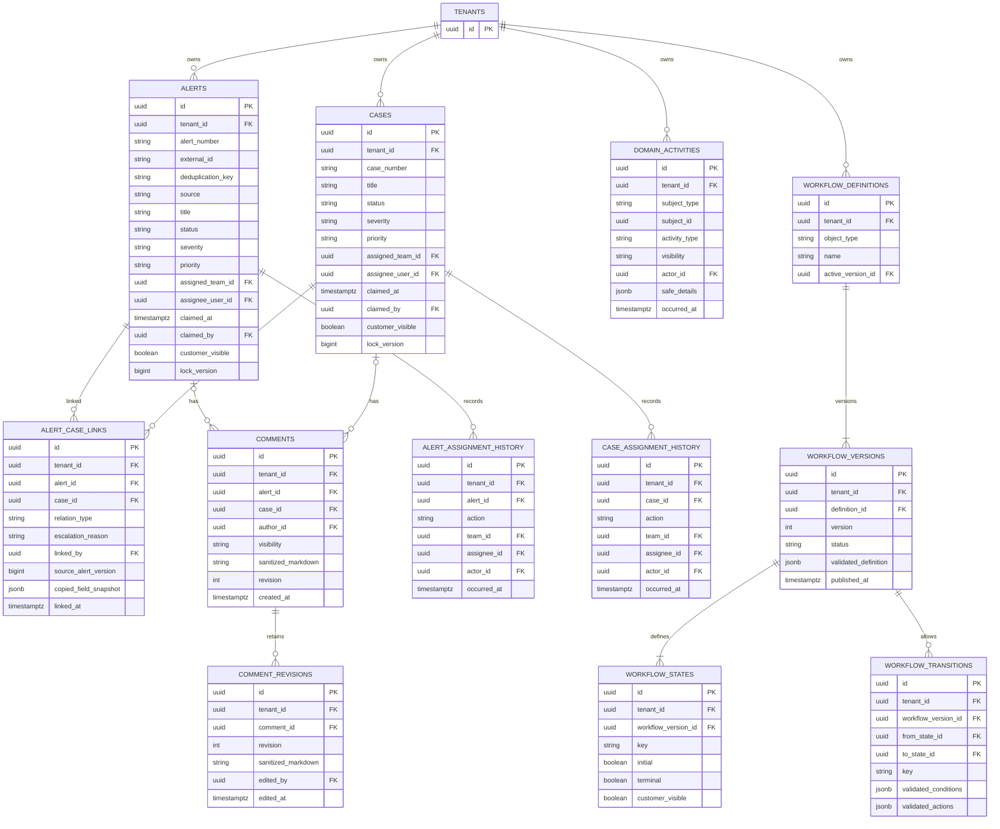
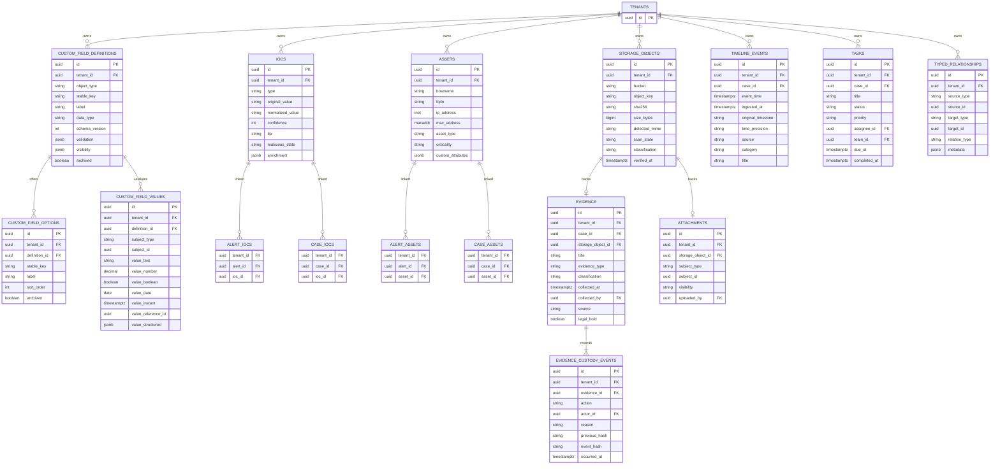
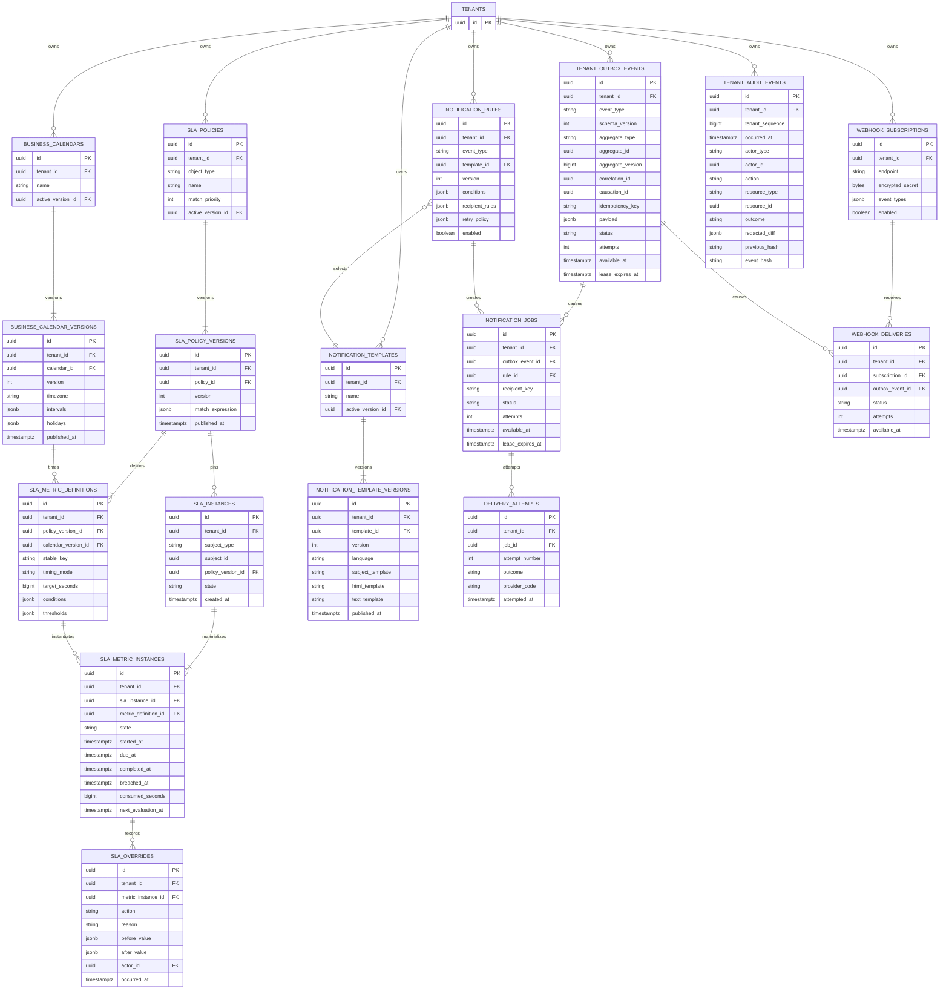

# Periapsis Conceptual ERD

Status: conceptual companion to the release-candidate Drizzle schema
Last updated: 2026-09-02

## 1. Reading this document

These diagrams define intended entities, ownership, and cardinality. They are not a second
SQL schema. `packages/db` Drizzle definitions are the canonical PostgreSQL schema and
generated migrations are the only deployment path. If a diagram and the
canonical schema diverge, the schema change requires a documentation update and, when the
decision is architectural, an ADR.

Conventions:

- IDs are UUIDv7 unless an entity explicitly uses a stable textual key.
- Every entity marked **tenant-owned** has `tenant_id NOT NULL`.
- Tenant-owned primary entities also expose `UNIQUE (tenant_id, id)` so dependent tables
  can use composite foreign keys and cannot connect rows from different tenants.
- Every tenant-owned table has forced RLS and tenant-leading indexes for real query paths.
- All instants use `timestamptz` in UTC; an IANA time-zone identifier is stored separately
  where display or calendar semantics require it.
- JSONB is limited to validated raw payloads, enrichment, declarative definitions,
  immutable snapshots, or versioned event envelopes.
- Platform-only catalogs and tenant-owned records are physically separate where nullable
  tenant ownership would weaken RLS, notably authentication providers, audit, and outbox.
- The diagrams omit repeated metadata such as `created_at`, `updated_at`, actor IDs, and
  optimistic versions when their presence is already stated in the domain model.

## Implemented ADR-0008 physical slice

This smaller diagram records the authentication, platform-administration, direct-human
tenant-RBAC, tenant-security-group, operator-team, service-principal, and minimal Alert
relationships that are physically present now. The broader diagram below remains the
forward model.

Tenant security groups are direct-only and retain independent membership-edge and
role-grant sources. Global operator teams use tenant-owned immutable assignment epochs and
exact-epoch source-owned rosters.

```mermaid
erDiagram
    USERS ||--o| LOCAL_BREAK_GLASS_CREDENTIALS : authenticates_with
    USERS ||--o| TOTP_CREDENTIALS : proves_mfa_with
    TOTP_CREDENTIALS ||--o{ RECOVERY_CODES : issues
    USERS ||--o{ AUTH_CHALLENGES : receives
    USERS ||--o{ AUTH_SESSIONS : owns
    AUTH_SESSIONS o|--o{ AUTH_SESSIONS : rotates_to
    USERS ||--o{ TENANT_MEMBERSHIPS : receives
    TENANTS ||--o{ TENANT_MEMBERSHIPS : grants
    USERS ||--o{ USER_PLATFORM_ROLES : receives
    PLATFORM_ROLES ||--o{ USER_PLATFORM_ROLES : binds
    PLATFORM_ROLES ||--o{ PLATFORM_ROLE_PERMISSIONS : contains
    PLATFORM_PERMISSIONS ||--o{ PLATFORM_ROLE_PERMISSIONS : grants
    PLATFORM_BOOTSTRAP_STATE ||--o| PLATFORM_BOOTSTRAP_ENROLLMENTS : completes_with
    USERS o|--o| PLATFORM_BOOTSTRAP_STATE : completes
    PLATFORM_AUDIT_CHAIN_HEAD ||--o{ PLATFORM_AUDIT_EVENTS : seals
    TENANTS ||--|| TENANT_AUTHORIZATION_STATES : serializes
    TENANTS ||--o{ TENANT_AUTHORIZATION_SOURCES : owns
    TENANTS ||--o{ TENANT_ROLES : owns
    TENANT_PERMISSIONS ||--o{ TENANT_PERMISSION_SCOPES : allows
    TENANT_ROLES ||--o{ TENANT_ROLE_PERMISSIONS : contains
    TENANT_ROLE_PERMISSIONS ||--o| TENANT_ROLE_DELEGATION_CEILINGS : delegates
    TENANT_MEMBERSHIPS ||--o{ TENANT_MEMBERSHIP_ROLE_GRANTS : receives
    TENANT_ROLES ||--o{ TENANT_MEMBERSHIP_ROLE_GRANTS : grants
    TENANT_AUTHORIZATION_SOURCES ||--o{ TENANT_MEMBERSHIP_ROLE_GRANTS : owns
    TENANTS ||--o{ TENANT_SECURITY_GROUPS : owns
    TENANT_SECURITY_GROUPS ||--o{ TENANT_SECURITY_GROUP_MEMBERSHIPS : contains
    TENANT_MEMBERSHIPS ||--o{ TENANT_SECURITY_GROUP_MEMBERSHIPS : joins
    TENANT_AUTHORIZATION_SOURCES ||--o{ TENANT_SECURITY_GROUP_MEMBERSHIPS : owns
    TENANT_SECURITY_GROUPS ||--o{ TENANT_SECURITY_GROUP_ROLE_GRANTS : receives
    TENANT_ROLES ||--o{ TENANT_SECURITY_GROUP_ROLE_GRANTS : grants
    TENANT_AUTHORIZATION_SOURCES ||--o{ TENANT_SECURITY_GROUP_ROLE_GRANTS : owns
    TENANTS ||--o{ OPERATOR_TEAM_ASSIGNMENT_EPOCHS : authorizes
    OPERATOR_TEAMS ||--o{ OPERATOR_TEAM_ASSIGNMENT_EPOCHS : serves
    OPERATOR_TEAM_ASSIGNMENT_EPOCHS ||--o{ OPERATOR_TEAM_ROSTER_ENTRIES : scopes
    TENANT_MEMBERSHIPS ||--o{ OPERATOR_TEAM_ROSTER_ENTRIES : joins
    TENANT_AUTHORIZATION_SOURCES ||--o{ OPERATOR_TEAM_ROSTER_ENTRIES : owns
    TENANT_MEMBERSHIPS ||--o{ TENANT_AUTHORIZATION_COMMANDS : replays
    TENANTS ||--o{ TENANT_SERVICE_ACCOUNTS : owns
    TENANT_MEMBERSHIPS ||--o{ TENANT_SERVICE_ACCOUNTS : creates_or_archives
    TENANT_SERVICE_ACCOUNTS ||--o{ TENANT_SERVICE_ACCOUNT_ROLE_GRANTS : receives
    TENANT_ROLES ||--o{ TENANT_SERVICE_ACCOUNT_ROLE_GRANTS : grants
    TENANT_AUTHORIZATION_SOURCES ||--o{ TENANT_SERVICE_ACCOUNT_ROLE_GRANTS : owns
    TENANT_SERVICE_ACCOUNTS ||--o{ TENANT_API_CREDENTIALS : authenticates_with
    TENANT_API_CREDENTIALS ||--o{ TENANT_API_CREDENTIAL_PERMISSIONS : narrows
    TENANT_API_CREDENTIALS ||--o{ TENANT_API_CREDENTIAL_NETWORKS : restricts
    TENANT_SERVICE_ACCOUNTS ||--o{ TENANT_API_CREDENTIAL_COMMANDS : replays
    TENANT_API_CREDENTIAL_COMMANDS }o--|| TENANT_API_CREDENTIALS : returns
    TENANTS ||--o{ ALERTS : owns
    TENANT_MEMBERSHIPS o|--o{ ALERTS : creates_as_human
    TENANT_SERVICE_ACCOUNTS o|--o{ ALERTS : creates_as_machine
    ALERTS ||--o{ ALERT_ACTIVITIES : records
    ALERTS ||--o{ ALERT_COMMANDS : replays
```

## 2. Tenancy, identity, authentication, and RBAC

```mermaid
erDiagram
    TENANTS {
        uuid id PK
        string slug UK
        string name
        string status
        string timezone
        string locale
        jsonb branding
        timestamptz created_at
    }

    USERS {
        uuid id PK
        string username UK
        string email
        string status
        timestamptz created_at
    }

    TENANT_USER_PROFILES {
        uuid id PK
        uuid tenant_id FK
        uuid user_id FK
        string display_name
        string timezone
        string locale
    }

    TENANT_MEMBERSHIPS {
        uuid id PK
        uuid tenant_id FK
        uuid user_id FK
        string status
        string provisioning_source
        timestamptz revoked_at
    }

    CUSTOMER_CONTACTS {
        uuid id PK
        uuid tenant_id FK
        uuid linked_user_id FK
        string first_name
        string last_name
        string email
        string language
        string timezone
        int escalation_priority
        boolean active
    }

    PERMISSIONS {
        string key PK
        string resource
        string action
    }

    ROLES {
        uuid id PK
        uuid tenant_id FK
        string key
        string name
        boolean system_role
    }

    ROLE_PERMISSIONS {
        uuid tenant_id FK
        uuid role_id FK
        string permission_key FK
        string scope
    }

    TENANT_AUTHORIZATION_SOURCES {
        uuid id PK
        uuid tenant_id FK
        string kind
        string owner_reference
        string status
    }

    TENANT_SECURITY_GROUPS {
        uuid id PK
        uuid tenant_id FK
        string name
        string status
    }

    TENANT_SECURITY_GROUP_MEMBERSHIPS {
        uuid id PK
        uuid tenant_id FK
        uuid group_id FK
        uuid tenant_membership_id FK
        uuid authorization_source_id FK
        timestamptz expires_at
        timestamptz revoked_at
    }

    TENANT_SECURITY_GROUP_ROLE_GRANTS {
        uuid id PK
        uuid tenant_id FK
        uuid group_id FK
        uuid role_id FK
        uuid authorization_source_id FK
        timestamptz expires_at
        timestamptz revoked_at
    }

    OPERATOR_TEAMS {
        uuid id PK
        string key UK
        string display_name
        timestamptz archived_at
    }

    OPERATOR_TEAM_ASSIGNMENT_EPOCHS {
        uuid id PK
        uuid tenant_id FK
        uuid operator_team_id FK
        timestamptz assigned_at
        timestamptz ended_at
        int version
    }

    OPERATOR_TEAM_ROSTER_ENTRIES {
        uuid id PK
        uuid tenant_id FK
        uuid operator_team_id FK
        uuid assignment_epoch_id FK
        uuid membership_id FK
        uuid source_id FK
        timestamptz expires_at
        timestamptz revoked_at
        int version
    }

    PLATFORM_ROLE_BINDINGS {
        uuid id PK
        uuid user_id FK
        string platform_role_key
        timestamptz expires_at
    }

    TENANT_AUTH_PROVIDERS {
        uuid id PK
        uuid tenant_id FK
        string type
        string name
        string status
        bytes encrypted_config
    }

    PLATFORM_AUTH_PROVIDERS {
        uuid id PK
        string type
        string name
        string status
        bytes encrypted_config
    }

    EXTERNAL_IDENTITIES {
        uuid id PK
        uuid user_id FK
        uuid tenant_id FK
        uuid tenant_provider_id FK
        string immutable_subject
        timestamptz last_login_at
    }

    LDAP_MAPPING_RULES {
        uuid id PK
        uuid tenant_id FK
        uuid provider_id FK
        uuid tenant_security_group_id FK
        uuid operator_team_id FK
        int priority
        string match_mode
        string grant_mode
        boolean enabled
    }

    SESSIONS {
        uuid id PK
        uuid user_id FK
        bytes token_hash
        string auth_method
        string assurance_level
        timestamptz idle_expires_at
        timestamptz absolute_expires_at
        timestamptz revoked_at
    }

    MFA_CREDENTIALS {
        uuid id PK
        uuid user_id FK
        string type
        bytes protected_secret
        timestamptz revoked_at
    }

    SERVICE_ACCOUNTS {
        uuid id PK
        uuid tenant_id FK
        string key
        string display_name
        string description
        uuid created_by_membership_id FK
        timestamptz archived_at
        int version
    }

    SERVICE_ACCOUNT_ROLE_GRANTS {
        uuid id PK
        uuid tenant_id FK
        uuid service_account_id FK
        uuid role_id FK
        uuid source_id FK
        timestamptz expires_at
        timestamptz revoked_at
        int version
    }

    API_CREDENTIALS {
        uuid id PK
        uuid tenant_id FK
        uuid service_account_id FK
        string label
        int format_version
        bytes locator UK
        int key_version
        bytes secret_digest
        timestamptz expires_at
        uuid rotated_from_credential_id FK
        timestamptz revoked_at
        timestamptz last_used_at
        inet last_used_ip
        int version
    }

    API_CREDENTIAL_PERMISSIONS {
        uuid tenant_id PK, FK
        uuid credential_id PK, FK
        uuid permission_id PK, FK
        string scope PK, FK
    }

    API_CREDENTIAL_NETWORKS {
        uuid tenant_id PK, FK
        uuid credential_id PK, FK
        cidr network PK
    }

    API_CREDENTIAL_COMMANDS {
        uuid id PK
        uuid tenant_id FK
        uuid service_account_id FK
        uuid actor_membership_id FK
        string operation
        bytes key_digest
        bytes request_digest
        uuid result_credential_id FK
        int result_version
    }

    TENANTS ||--o{ TENANT_USER_PROFILES : owns
    USERS ||--o{ TENANT_USER_PROFILES : has
    TENANTS ||--o{ TENANT_MEMBERSHIPS : grants
    USERS ||--o{ TENANT_MEMBERSHIPS : receives
    TENANTS ||--o{ CUSTOMER_CONTACTS : owns
    USERS o|--o{ CUSTOMER_CONTACTS : may_link
    TENANTS ||--o{ ROLES : owns
    ROLES ||--o{ ROLE_PERMISSIONS : grants
    PERMISSIONS ||--o{ ROLE_PERMISSIONS : included_by
    TENANTS ||--o{ TENANT_AUTHORIZATION_SOURCES : owns
    TENANTS ||--o{ TENANT_SECURITY_GROUPS : owns
    TENANT_SECURITY_GROUPS ||--o{ TENANT_SECURITY_GROUP_MEMBERSHIPS : contains
    TENANT_MEMBERSHIPS ||--o{ TENANT_SECURITY_GROUP_MEMBERSHIPS : joins
    TENANT_AUTHORIZATION_SOURCES ||--o{ TENANT_SECURITY_GROUP_MEMBERSHIPS : owns
    TENANT_SECURITY_GROUPS ||--o{ TENANT_SECURITY_GROUP_ROLE_GRANTS : receives
    ROLES ||--o{ TENANT_SECURITY_GROUP_ROLE_GRANTS : assigned
    TENANT_AUTHORIZATION_SOURCES ||--o{ TENANT_SECURITY_GROUP_ROLE_GRANTS : owns
    TENANTS ||--o{ OPERATOR_TEAM_ASSIGNMENT_EPOCHS : authorizes
    OPERATOR_TEAMS ||--o{ OPERATOR_TEAM_ASSIGNMENT_EPOCHS : serves
    OPERATOR_TEAM_ASSIGNMENT_EPOCHS ||--o{ OPERATOR_TEAM_ROSTER_ENTRIES : scopes
    TENANT_MEMBERSHIPS ||--o{ OPERATOR_TEAM_ROSTER_ENTRIES : joins
    TENANT_AUTHORIZATION_SOURCES ||--o{ OPERATOR_TEAM_ROSTER_ENTRIES : owns
    USERS ||--o{ PLATFORM_ROLE_BINDINGS : has
    TENANTS ||--o{ TENANT_AUTH_PROVIDERS : configures
    USERS ||--o{ EXTERNAL_IDENTITIES : resolves_to
    TENANT_AUTH_PROVIDERS ||--o{ EXTERNAL_IDENTITIES : authenticates
    TENANT_AUTH_PROVIDERS ||--o{ LDAP_MAPPING_RULES : defines
    TENANT_SECURITY_GROUPS ||--o{ LDAP_MAPPING_RULES : maps_to
    OPERATOR_TEAMS o|--o{ LDAP_MAPPING_RULES : optionally_maps_to
    USERS ||--o{ SESSIONS : opens
    USERS ||--o{ MFA_CREDENTIALS : enrolls
    TENANTS ||--o{ SERVICE_ACCOUNTS : owns
    SERVICE_ACCOUNTS ||--o{ SERVICE_ACCOUNT_ROLE_GRANTS : receives
    ROLES ||--o{ SERVICE_ACCOUNT_ROLE_GRANTS : grants
    TENANT_AUTHORIZATION_SOURCES ||--o{ SERVICE_ACCOUNT_ROLE_GRANTS : owns
    SERVICE_ACCOUNTS ||--o{ API_CREDENTIALS : authenticates_with
    API_CREDENTIALS ||--o{ API_CREDENTIAL_PERMISSIONS : narrows
    PERMISSIONS ||--o{ API_CREDENTIAL_PERMISSIONS : allows
    API_CREDENTIALS ||--o{ API_CREDENTIAL_NETWORKS : restricts
    SERVICE_ACCOUNTS ||--o{ API_CREDENTIAL_COMMANDS : replays
    API_CREDENTIAL_COMMANDS }o--|| API_CREDENTIALS : returns
```

`EXTERNAL_IDENTITIES` above represents tenant-provider identities. Platform-provider
identities use a physically separate platform table so tenant-owned rows never have a
nullable `tenant_id`. Recovery codes are stored in a child table as one-use hashes, not in
plaintext or reversible form. Provider secret configuration is encrypted and write-only
through the API.

`TENANT_SECURITY_GROUP_MEMBERSHIPS` has no self/group parent reference: Phase 2B.2a is a
direct-only graph. The membership and role-grant edges retain separate authorization
sources. Their join explains the `group` authority path, while those source
rows identify who may reconcile each contribution.

`OPERATOR_TEAMS` is the global platform-owned identity. Its assignment epochs and roster
entries are tenant-owned and forced-RLS records. A new assignment uses a new epoch and
cannot inherit old roster rows. A future provider rule may name a team only through the
protected reconciliation planner for the current tenant assignment epoch rather than
writing a global membership. Global team lifecycle is
platform-audited, while assignment and roster changes are tenant-audited with correlated
events for cross-boundary commands.

## 3. Alerts, Cases, workflow, and comments

The physical `COMMENTS` constraint requires exactly one of `alert_id` or `case_id`, and
each optional reference uses a composite `(tenant_id, id)` foreign key. If PostgreSQL
constraints are clearer with dedicated Alert/Case comment tables, the Drizzle schema may
split them while retaining the domain concept. `DOMAIN_ACTIVITIES` similarly requires a
database-enforced subject registry or type-specific tables; an unconstrained polymorphic
ID is not acceptable merely for convenience.

## 4. Custom fields and DFIR records

Alert/Case foreign-key endpoints omitted from this visual use the same composite tenant
keys shown in the previous diagram. `CUSTOM_FIELD_VALUES`, `ATTACHMENTS`, and
`TYPED_RELATIONSHIPS` require either a tenant-owned object registry or generated
type-specific tables/constraints. The implementation must not accept dangling or
cross-tenant polymorphic references.

Only one type-appropriate value column in `CUSTOM_FIELD_VALUES` may be populated, with a
constraint derived from the definition's data type. Missing, explicit null, and empty
values remain distinguishable. Evidence custody events are append-only; storage object
deletion is blocked while evidence, retention, or legal hold requires the bytes.

## 5. SLA, notifications, webhooks, outbox, and audit

Platform audit and platform outbox events use separate tables with platform-only access
policies. Runtime application roles have `INSERT` but not `UPDATE` or `DELETE` on audit
records. Outbox rows contain minimal, versioned, visibility-safe payloads; they never store
provider secrets or unrestricted aggregate snapshots.

## 6. Database constraints and indexes

The canonical schema includes, at minimum:

- `tenant_id NOT NULL` and `FORCE ROW LEVEL SECURITY` on every tenant-owned table;
- composite foreign keys that repeat `tenant_id` on every tenant-owned relationship;
- tenant-specific uniqueness for Alert/Case numbers, stable custom-field keys, workflow
  versions, SLA keys/versions, idempotency keys, and provider subjects;
- checks for exactly-one comment subject and type-correct custom-field values;
- conditional claim updates guarded by tenant, ID, expected version, eligible status, and
  unclaimed/current-assignment state;
- immutable published workflow, SLA, calendar, and template versions;
- append-only permissions for audit/custody history;
- tenant-leading indexes for status/severity/priority, assignee/team, SLA due/state,
  received/opened time, full-text search, and custom fields used by actual list queries;
- partial queue indexes on outbox/job `status`, `available_at`, and expired leases;
- recipient/delivery and command idempotency unique constraints;
- object key uniqueness and evidence SHA-256/scan-state lookup indexes scoped by tenant;
- retention-aware indexes and partitions only when observed data volume justifies them.

RLS policy tests must exercise direct ID access, joins, search, filters, export, job claims,
and object metadata. Database constraints and RLS are defense in depth; they do not remove
the requirement for backend authorization and visibility policy.

## 7. Delivery sequence

The diagrams span the completed staged order: Tenant/User/Membership/RBAC primitives plus
audit/outbox; authentication; Alert/Case; DFIR/custom fields; SLA;
notifications/webhooks; bulk/export; and platform/audit operations. No later entity may
weaken tenant ownership, and no placeholder table or migration is committed without the use
case and verification that consume it.
