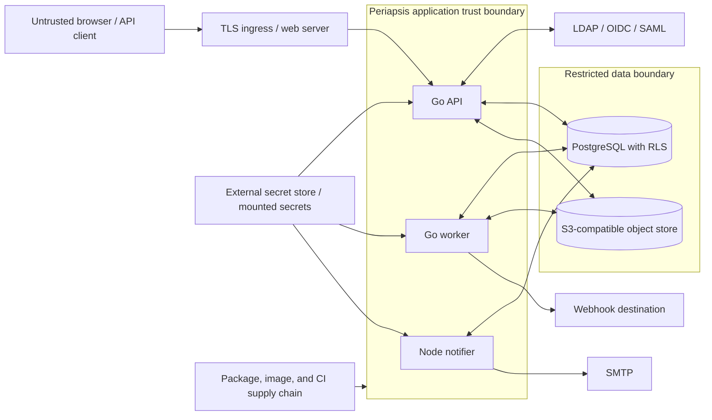
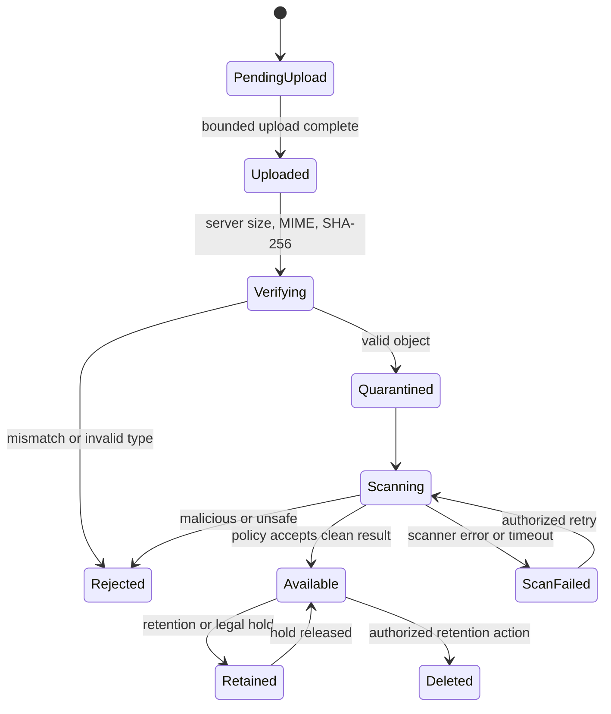

# Periapsis threat model

Status: Living security document for the release-candidate trust boundaries
Last updated: 2026-09-02
Review cadence: every material trust-boundary change and before each release

## 1. Scope and status

This threat model covers the implemented Periapsis web application, Go API and worker, Node
notifier, PostgreSQL database, S3-compatible evidence storage, LDAP/OIDC/SAML integrations,
SMTP delivery, webhooks, generated contracts, container images, and deployment manifests.

The current repository implements the controls for tenant/platform identity, ticketing,
DFIR, SLA, notification/webhook, bulk/export, audit/retention, observability, and deployment
trust boundaries. Security is not deferred to a hardening phase: every feature ships with
the controls and tests relevant to its threat surface. A vertical slice that cannot preserve
tenant isolation, backend authorization, private-data visibility, audit/outbox atomicity,
secret handling, and least privilege is incomplete. Retained external runtime and production
evidence is tracked separately in [`TASKS.md`](../TASKS.md).

The model uses STRIDE-style analysis plus explicit abuse cases. Risk is qualitative:
Critical, High, Medium, or Low based on plausible impact and likelihood in an MSSP/SOC
deployment. Residual risk must be accepted by an accountable owner, not silently ignored.

## 2. Protected assets

| Class                           | Examples                                                                                                                                                        | Required handling                                                                                                        |
| ------------------------------- | --------------------------------------------------------------------------------------------------------------------------------------------------------------- | ------------------------------------------------------------------------------------------------------------------------ |
| Restricted secrets              | LDAP bind password, OIDC/SAML client secrets/private keys, SMTP credentials, API keys, session tokens, MFA seeds, recovery codes, webhook HMAC keys, master key | External secret source; encryption or one-way hash as appropriate; write-only; strict redaction; rotation and revocation |
| Restricted investigation data   | private comments, evidence, raw alert payloads, IOC, internal analyst notes, custody records, customer identifiers                                              | Tenant isolation, least privilege, encryption in transit/at rest, explicit visibility projections, audited access        |
| Confidential identity data      | user/contact profile, email/phone, LDAP attributes/groups, IdP claims, IP/user agent                                                                            | Minimize, tenant/scope policy, retention, redacted telemetry                                                             |
| Integrity-critical control data | roles, permissions, memberships, provider mappings, workflows, SLA, template/rule versions, scan state                                                          | Privileged change policy, optimistic concurrency, immutable versions, audit and tamper detection                         |
| Integrity-critical evidence     | SHA-256, object metadata, chain of custody, audit chain                                                                                                         | Append-only history, protected storage, verified hashes, protected backups/export                                        |
| Availability-critical state     | Alerts, Cases, assignments, queues, SLA deadlines, outbox jobs                                                                                                  | Transactional durability, idempotency, bounded retries, backpressure, backup/restore                                     |

## 3. Actors and attacker assumptions

Legitimate actors include platform administrators/auditors, tenant administrators,
operators, customer users, service accounts, migration/worker/notifier identities, and
external identity, storage, SMTP, and webhook systems.

Threat actors include:

- an authenticated user attempting to access another tenant or a stronger scope;
- a malicious/compromised tenant administrator or service account;
- an Internet attacker targeting login, API, webhook, upload, or SSO endpoints;
- a compromised IdP, SMTP endpoint, webhook receiver, object store, dependency, image, or
  CI runner;
- an insider with database, deployment, or backup access;
- a buggy application path that omits tenant or visibility filtering;
- concurrent clients/workers exploiting races or replay.

Assume client input, path IDs, headers, IdP attributes/claims, LDAP entries, filenames,
MIME declarations, raw alert payloads, template/rule definitions, URLs, email content,
and webhook responses are hostile until validated.

## 4. Trust boundaries and principal flows

Principal data flows requiring their own authorization and visibility policy are direct
resource APIs, search, include/expand, bulk changes, exports, object upload/download,
notification context creation, webhook payload creation, and background job consumption.
Success on one path is not evidence that another path is safe.

## 5. Security invariants

1. Tenant-owned rows have immutable `tenant_id NOT NULL`, forced RLS, tenant-consistent
   foreign keys, and fail-closed transaction-local tenant context.
2. The backend checks identity, tenant membership, permission and scope, token scope,
   team/assignment, workflow state, and visibility for every action.
3. General runtime roles cannot bypass RLS; migration and exceptional audit roles are
   isolated and never used for normal requests.
4. A path tenant is checked against server-side grants. Customer users cannot override it
   with a header; platform access is explicit, reason-bearing, one-tenant-at-a-time, and
   audited.
5. Private/operator-only data is excluded before customer API, search, export, email,
   webhook, and portal representations are built.
6. A mutation, activity, append-only audit event, and required outbox event commit in one
   transaction.
7. Claims and retryable commands are conditional, concurrency-safe, and idempotent.
8. Evidence access is freshly authorized; bytes are verified, hashed, scanned, classified,
   and custody tracked. A pre-signed URL or object key is not authorization.
9. User-authored expressions/templates cannot execute arbitrary code, SQL, filesystem,
   network, or processes.
10. No custom cryptographic primitive or hand-written authentication protocol is allowed.
11. Secrets remain outside source/images/logs/responses and are encrypted or hashed as
    appropriate.
12. Application containers run non-root with least privilege and read-only filesystem
    compatibility.

## 6. Threat register

### 6.1 Tenancy and authorization

| ID / risk    | Threat and attack path                                                                                                                                                                                                                    | Required preventive/detective controls                                                                                                                                                                                                                              | Verification and residual risk                                                                                                                                                                                                                                           |
| ------------ | ----------------------------------------------------------------------------------------------------------------------------------------------------------------------------------------------------------------------------------------- | ------------------------------------------------------------------------------------------------------------------------------------------------------------------------------------------------------------------------------------------------------------------- | ------------------------------------------------------------------------------------------------------------------------------------------------------------------------------------------------------------------------------------------------------------------------ |
| T01 Critical | **Tenant data leakage.** A missing predicate, join, search index, export worker, notification, webhook, or object lookup returns Tenant B data to Tenant A.                                                                               | Server-derived tenant context; `tenant_id NOT NULL`; forced RLS; composite tenant FKs; tenant-aware repository interfaces; visibility-safe projections; tenant carried in every job and storage record; no general `BYPASSRLS`.                                     | Automated cross-tenant read/write/search/export/download/notification/webhook tests at API and raw DB levels. Residual risk: a privileged migration/backup operator; mitigated operationally with separation, audit, and encryption.                                     |
| T02 Critical | **Broken access control.** An endpoint, bulk action, include, websocket/future channel, or worker performs an action without full policy.                                                                                                 | Central deny-by-default policy invoked by application use cases; endpoint-to-permission mapping; scopes `own/assigned/team/tenant/platform`; field and workflow policy; backend enforcement independent of UI.                                                      | RBAC matrix and route inventory tests; negative tests for every command and projection; static/review gate for direct repository calls. Residual risk: policy specification error, reduced by independent security tests.                                                |
| T03 High     | **IDOR.** A valid user substitutes an Alert, Case, contact, attachment, or evidence UUID from another tenant or outside scope.                                                                                                            | Opaque UUIDv7 is non-security; load by `(tenant_id, id)` under RLS; resource policy after lookup; safe 404/403 behavior; no authorization solely from signed URL possession.                                                                                        | Direct-ID tests across tenants, teams, customer visibility, deleted/archived state, and object download.                                                                                                                                                                 |
| T04 Critical | **Privilege escalation.** A tenant admin grants above their ceiling; a provider mapping grants platform admin; a bearer widens its scope or spoofs its CIDR; mixed cookie/bearer state changes the principal; or impersonation is hidden. | Delegation ceiling; protected platform permissions; exact live role/credential intersection; expiring keyed-digest credentials; explicit trusted-proxy chain; mutually exclusive authentication modes; explicit impersonation/platform mode; atomic audited grants. | Role/grant property tests, mapping dry-run parity, token-scope/CIDR/proxy/header-smuggling tests, cross-tenant bearer tests, and audit assertions. Residual risk: compromised existing platform admin, mitigated with MFA, separation, alerting, and break-glass review. |
| T05 High     | **Private-data channel leak.** A private comment or hidden custom field reaches customer UI/API, email, webhook, search, export, notification preview, or mention.                                                                        | Separate public/private event schemas; allowlist-based customer projection built before serialization/template rendering; recipient authorization snapshot; attachment inherits restrictive visibility; no raw aggregate in events.                                 | End-to-end tests for every channel and trigger, including retries and previews. This is a release-blocking invariant.                                                                                                                                                    |

### 6.2 Injection and active content

| ID / risk    | Threat and attack path                                                                                                                                                                                 | Required preventive/detective controls                                                                                                                                                                                                                                                            | Verification and residual risk                                                                                                                                                                                  |
| ------------ | ------------------------------------------------------------------------------------------------------------------------------------------------------------------------------------------------------ | ------------------------------------------------------------------------------------------------------------------------------------------------------------------------------------------------------------------------------------------------------------------------------------------------- | --------------------------------------------------------------------------------------------------------------------------------------------------------------------------------------------------------------- |
| T06 High     | **LDAP injection.** User text or administrator-provided test input alters an LDAP filter/DN, causing broad search, auth bypass, or disclosure.                                                         | Mature LDAP library; RFC-compliant filter/DN escaping; validated filter templates with fixed placeholders; allowlisted attributes; bounded page/time/referral/nesting; least-privileged bind; sanitized errors.                                                                                   | Unit/property tests with metacharacters, malformed UTF-8/DNs, wildcard expansion, nested groups, timeouts, and result limits; integration against test LDAP.                                                    |
| T07 Critical | **SQL injection.** Filters, sort, search, custom fields, reports, or expressions become concatenated SQL.                                                                                              | pgx/sqlc parameterization; allowlisted sort/filter AST compiled to fixed fragments; no raw user SQL; statement timeout; least-privileged roles; query review.                                                                                                                                     | Injection corpus across list/search/report/custom field; static scan for string-built SQL; contract fuzzing.                                                                                                    |
| T08 High     | **Stored/reflected XSS.** Markdown, raw alert data, contact data, IOC/URLs, filenames, custom field labels, or error text executes in the web UI.                                                      | Contextual React encoding; sanitize Markdown with strict allowlist; reject arbitrary comment HTML; CSP and security headers; safe link schemes; no raw HTML rendering absent reviewed sanitizer; never put sensitive data in toast/errors.                                                        | Component/E2E payload corpus for tags, URLs, SVG/MathML, malformed markup, Unicode, and CSP; dependency-specific sanitizer regression tests.                                                                    |
| T09 High     | **CSRF.** A hostile site makes an authenticated browser mutate tenant data or provider settings.                                                                                                       | HttpOnly Secure cookies with appropriate SameSite; per-session CSRF token or robust origin-bound pattern; Origin/Referer validation; no state change via GET; re-auth/step-up for critical changes.                                                                                               | Cross-origin E2E tests for form, JSON, multipart upload, logout, and SSO callback edge cases.                                                                                                                   |
| T10 Critical | **SSRF.** Webhook test/delivery, OIDC discovery/JWKS, SAML metadata, attachment enrichment, URL preview, or SMTP/LDAP configuration reaches loopback, metadata, internal networks, or redirects there. | Per-feature destination allowlist/deny policy; canonical URL parsing; only required schemes/ports; resolve and validate every connection and redirect; block loopback, link-local, private/reserved networks by default; DNS-rebinding defense; egress network policy; response/time/size limits. | SSRF suite covering IPv4/IPv6 variants, decimal/octal, userinfo, redirects, DNS changes, CNAME, and cloud metadata endpoints. Explicit administrator exceptions are scoped and audited.                         |
| T11 Critical | **Template/expression injection.** A template, workflow, SLA rule, regex, or custom validation executes code or consumes unbounded resources.                                                          | Sandboxed declarative engines; no eval/JavaScript/SQL; no filesystem/network/process access; allowlisted functions and context; parse-time validation; step/output/recursion/time limits; safe regex engine or complexity limits; auto-escape.                                                    | Malicious template/expression corpus, timeout/memory tests, forbidden property traversal, prototype access, secret/context probing, and fuzzing.                                                                |
| T12 High     | **Malicious email HTML/CSS.** Template CSS/HTML exfiltrates data, loads tracking/internal resources, spoofs UI, or executes in permissive clients.                                                     | Sanitize HTML and CSS; block script, iframe, form, object, handlers and unsafe schemes; block remote `url()`/resources by default; allowlist deliberate resources; inline CSS only after sanitization; cap output; separate plaintext; preview in isolation.                                      | Sanitizer tests for CSS escapes, nested at-rules, data/file/javascript URLs, SVG, malformed HTML, and client-oriented payload corpus. Residual risk: email-client rendering variance; document the safe subset. |

### 6.3 Authentication and session threats

| ID / risk    | Threat and attack path                                                                                                                                     | Required preventive/detective controls                                                                                                                                                                                                                                                             | Verification and residual risk                                                                                                                                                                  |
| ------------ | ---------------------------------------------------------------------------------------------------------------------------------------------------------- | -------------------------------------------------------------------------------------------------------------------------------------------------------------------------------------------------------------------------------------------------------------------------------------------------- | ----------------------------------------------------------------------------------------------------------------------------------------------------------------------------------------------- |
| T13 Critical | **SAML signature bypass.** Unsigned/wrapping-manipulated assertion, wrong issuer/audience/recipient, stale response, or malicious metadata is accepted.    | Mature maintained SAML library; require signature according to policy and validate the signed element actually consumed; issuer, audience, destination/recipient, InResponseTo, time bounds and replay cache; pinned/validated metadata; multiple certs only for controlled rotation; fail closed. | Corpus for wrapping, unsigned assertion/response combinations, duplicate IDs, algorithm downgrade, wrong audience/recipient/issuer, clock boundaries, and replay. No custom XML signature code. |
| T14 Critical | **OIDC replay/substitution.** Stolen code/token, mixed issuer, wrong audience, nonce/state bypass, PKCE downgrade, or stale JWKS grants a session.         | Authorization Code + PKCE; exact issuer and audience/azp validation; cryptographic state/nonce bound to browser transaction; one-time callback state; code verifier; token time/algorithm checks; trusted discovery/JWKS with bounded cache/rotation; session revocation.                          | Tests for replay, wrong issuer/audience/nonce/state, code injection, duplicate callback, key rotation, clock skew, and logout/revocation.                                                       |
| T15 High     | **Credential stuffing and recovery abuse.** Automated login, MFA/recovery, LDAP bind, or API-key attempts discover valid accounts or exhaust upstream IdP. | Layered IP/account/device rate limits, bounded exponential delay/lockout, generic errors, MFA and admin MFA requirement, breached-password policy where local auth exists, alerting, upstream timeouts/circuit protection.                                                                         | Load/security tests for distributed attempts and username enumeration; metrics/alerts on failure rates. Avoid permanent attacker-triggered lockout.                                             |
| T16 High     | **Session fixation/theft.** A pre-auth session survives login or privilege change; cookies leak; old sessions remain valid after revocation.               | Rotate session ID after authentication/MFA/privilege changes; only hashed server-side session tokens; HttpOnly Secure SameSite cookie, narrow path/domain; absolute and idle expiry; session listing/revocation; CSRF; no token in URL/log/storage.                                                | Login/step-up/role-change fixation tests, old-token rejection, concurrent revocation, cookie attribute checks, logout and provider-change audit.                                                |
| T17 High     | **MFA downgrade/recovery-code compromise.** IdP MFA claim is trusted too broadly, a recovery code is reusable, or enrollment is hijacked.                  | Tenant policy explicitly maps AMR/AuthnContext; local step-up when evidence is insufficient; recovery codes one-use and hashed; enrollment/revocation requires fresh assurance; mandatory admin MFA; audited device lifecycle.                                                                     | AMR/AuthnContext matrix, one-use race test, enrollment CSRF/session tests, code regeneration invalidation, and revoked-device tests.                                                            |

### 6.4 Files, integrations, integrity, and availability

| ID / risk    | Threat and attack path                                                                                                                                                         | Required preventive/detective controls                                                                                                                                                                                                                                                                                                                                                       | Verification and residual risk                                                                                                                                                                                                                                                               |
| ------------ | ------------------------------------------------------------------------------------------------------------------------------------------------------------------------------ | -------------------------------------------------------------------------------------------------------------------------------------------------------------------------------------------------------------------------------------------------------------------------------------------------------------------------------------------------------------------------------------------- | -------------------------------------------------------------------------------------------------------------------------------------------------------------------------------------------------------------------------------------------------------------------------------------------- |
| T18 Critical | **File upload abuse.** Oversize/decompression-bomb/polyglot/active content, spoofed MIME, malware, path injection, hash mismatch, overwrite, or race exposes users/systems.    | Upload size/count/time limits; opaque create-only object keys with a signed `If-None-Match: *` precondition; signed declared-MIME metadata compared with server byte detection; stream SHA-256 and size verification; quarantine state; configurable AV/sandbox hook; no inline execution; safe content disposition; scan before availability; object-store least privilege; orphan cleanup. | Upload corpus including concurrent/replayed PUTs, polyglots, archives, SVG/HTML, executable content, Unicode filenames, interrupted multipart uploads, hash/size mismatch, scan failure, and unauthorized download. Residual risk follows configured scanner capability and must be visible. |
| T19 High     | **Pre-signed URL/object access abuse.** URL is issued without fresh policy, lasts too long, is logged/shared, or object key crosses tenant.                                    | Authorize tenant/resource/visibility/scan state on every issue; tenant-bound object metadata; short expiry, narrow operation/content constraints; TLS; redact query strings; no public buckets; optional one-time proxy for highest classifications.                                                                                                                                         | Cross-tenant/direct-key tests, expired URL, changed permission after issue, response header/content type, and log-redaction tests. Residual risk during URL lifetime is minimized, not eliminated.                                                                                           |
| T20 High     | **Audit tampering or repudiation.** Application/insider alters, deletes, reorders, forks, or floods audit, or secrets enter diffs.                                             | Append-only grants; runtime roles lack update/delete; transaction-coupled events; per-tenant sequence/hash chain with canonical serialization; protected backup/external verification; secret redaction; audit access is audited; capacity alerts.                                                                                                                                           | Database privilege tests, chain verification, mutation/delete denial, rollback behavior, redaction corpus, missing-event invariant tests, and restore verification. Hash chaining detects but does not prevent a fully privileged attacker; externalized checkpoints reduce residual risk.   |
| T21 High     | **Webhook replay/forgery and payload leak.** Captured delivery is replayed; secret is weak/reused; payload includes private/cross-tenant data.                                 | Per-subscription rotatable random HMAC secret; versioned canonical payload; timestamp + event/delivery ID; receiver replay window guidance; TLS; recipient-specific visibility projection; at-least-once idempotency; sanitized logs; SSRF controls.                                                                                                                                         | Signature vectors, timestamp/replay tests, secret rotation overlap/revocation, retry idempotency, private-data and cross-tenant payload tests.                                                                                                                                               |
| T22 High     | **Claim/transition race.** Two operators claim the same item, a stale transition wins, or retry creates duplicate Case/events.                                                 | Atomic conditional update with expected version and eligible state; unique idempotency result; transaction covers state/history/activity/audit/SLA/outbox; loser receives conflict; consumers idempotent.                                                                                                                                                                                    | Concurrent claim/transition/escalation tests under real PostgreSQL and race-enabled Go tests.                                                                                                                                                                                                |
| T23 High     | **Supply-chain compromise.** Malicious or vulnerable Go/npm package, generated artifact, base image, build action, or toolchain enters release.                                | Verify package existence/maintenance before addition; lock versions/checksums; minimal dependencies; protected reviews; trusted pinned CI actions/images; reproducible installs; generated-drift check; SAST, dependency/secret/container scanning; SBOM/provenance; signed releases where supported.                                                                                        | CI scans on PR/main/release, lockfile review, clean checkout rebuild, SBOM inspection, vulnerability exception expiry. Residual risk: zero-days/maintainer compromise; use monitoring and rapid patch process.                                                                               |
| T24 Critical | **Secret leakage.** Secrets appear in repository/history, image layers, generated clients, environment dumps, logs, traces, audit diffs, errors, previews, or support bundles. | External/mounted secret files; envelope encryption with external master key; token/keyed-digest-only storage; write-only API; centralized redaction; structured allowlisted logging; no secret build args/layers; secret scan; rotation/revocation procedure.                                                                                                                                | Canary secret/redaction tests, repository/image/history scans, API read-back tests, error-path inspection, support-bundle review. Treat any suspected exposure as compromise and rotate.                                                                                                     |
| T25 High     | **Queue/retry abuse or denial of service.** Poison jobs, notification loops, expensive search/export, or tenant flooding exhausts DB/workers/external providers.               | Payload/query limits; cursor pagination; async bounded exports; per-tenant/global quotas; leases and attempt caps; exponential backoff with jitter; dead-letter; queue age/depth alerts; no-loop SLA system-alert marker; statement/render/network timeouts; fair scheduling.                                                                                                                | Load tests at target volumes, poison-message tests, backpressure/recovery, tenant fairness, retry storms, and SLA loop prevention.                                                                                                                                                           |

## 7. Protocol and integration rules

### LDAP

- Bind secrets are encrypted, never returned, and bind accounts are read-only/minimal.
- TLS/StartTLS certificate verification defaults on; disabling verification requires an
  explicit privileged, warned, audited development-only decision.
- Filters, DNs, attributes, referrals, paging, nested-group resolution, and search results
  are bounded and validated.
- Mapping dry-run and login/sync use the same normalization and evaluation engine.
- Authentication errors are sanitized and do not expose DNs, attributes, or bind details.

### OIDC and SAML

- Provider selection is tenant/policy controlled; callback state binds the provider,
  browser transaction, redirect target, and tenant intent.
- Exact issuer/audience/recipient validation is mandatory; clock skew is bounded.
- Replay caches are durable enough for concurrent replicas and use one-time semantics.
- JIT/mapping changes are transactional and audited; no claim directly becomes a platform
  privilege.
- Protocol libraries are mature and maintained; cryptography/XML signature handling is
  never reimplemented.

### Service-account bearer credentials

- Cookie and bearer authentication are mutually exclusive. The API accepts one bounded
  Authorization value and rejects duplicate, comma-folded, mixed-scheme, or session-cookie
  combinations without revealing which credential check failed.
- The token envelope is canonical and length-bounded. Only a keyed digest is retained;
  source keys are file-mounted, domain-separated, versioned, and covered by live-version
  readiness.
- The single database bearer entry point authenticates and rechecks tenant, account,
  source, role, credential, expiry, exact allowlist, and canonical client CIDR in the same
  transaction as the Alert command. Runtime roles cannot call its private verifier or
  install a machine-principal GUC.
- Issue and rotation show the token exactly once and use durable idempotency tombstones.
  Responses are `no-store`; a lost response is reconciled to redacted metadata and requires
  revoke/reissue rather than secret recovery.
- Both web and API trusted-proxy boundaries resolve bounded forwarding chains right to
  left and reject malformed hops. Untrusted peers cannot choose the CIDR identity used by
  a credential decision.

### SMTP and webhooks

- SMTP and webhook credentials are encrypted and write-only; connection failures redact
  endpoints/recipients according to logging policy.
- Notification recipients are selected only within the event tenant and after visibility
  filtering. Explicit email addresses require a tenant policy.
- Webhook destinations receive SSRF validation on creation, test, every connection, and
  every redirect; egress network policy is a second boundary.
- Provider responses are bounded and sanitized before storage.

## 8. File/evidence state model

Only `Available` objects satisfying current tenant/resource policy can produce a download
authorization. `ScanFailed`, unavailable scanner, and unknown file type fail closed unless
a documented tenant policy and privileged, audited override explicitly allows a safer
handling mode. Original filenames are metadata, never object keys or filesystem paths.

## 9. Logging, monitoring, and audit detections

Security telemetry includes normalized, low-cardinality event types for authentication
failure/rate limit, mapping/grant change, platform access/impersonation, RLS/policy denial,
claim conflict, upload rejection/scan failure, webhook SSRF rejection, queue age/dead
letter, audit-chain verification, and secret-redaction failures.

Routine telemetry must not contain tokens, credentials, assertions, recovery codes, full
private comments, raw alert payloads, rendered email bodies, unrestricted LDAP attributes,
or pre-signed URL query strings. Tenant IDs may be retained only under the documented
observability access/retention policy; raw PII/IOC must not become metric labels.

Alerts should identify suspicious patterns without making the application unavailable to
an attacker-controlled flood. Rate-limit and lockout signals require per-source and
per-account aggregation with privacy-preserving identifiers.

## 10. Security verification gates by phase

| Phase | Security work that must be complete in that phase                                                                                                                                                 |
| ----- | ------------------------------------------------------------------------------------------------------------------------------------------------------------------------------------------------- |
| 0     | Threat model, ADR invariants, secure defaults, dependency admission rules, minimum secret scanning/CI design                                                                                      |
| 1     | Forced RLS, composite tenant FKs, separated DB roles, audit append-only privileges/hash verification, outbox tenant ownership, cross-tenant DB/API tests                                          |
| 2     | Backend RBAC matrix, delegation ceiling, session/CSRF/rate limit, MFA/recovery, service-account/keyring authority, LDAP injection, OIDC/SAML replay/signature validation, mapping privilege tests |
| 3     | IDOR and visibility tests for every Alert/Case path, claim race, optimistic concurrency, idempotent escalation, public/private comment channel tests                                              |
| 4     | Typed custom-field validation/visibility, upload limits/quarantine/scanning, pre-signed URL authorization, evidence hash/custody/legal-hold tests                                                 |
| 5     | Sandboxed SLA expressions, DST/calendar correctness, idempotent triggers, override authorization/audit, system-alert loop prevention                                                              |
| 6     | Recipient isolation, template HTML/CSS sandbox/sanitization, SMTP secret handling, webhook SSRF/HMAC/replay, retry/dead-letter/idempotency tests                                                  |
| 7     | Non-root/read-only container tests, network/security context validation, SAST/dependency/secret/container scans, SBOM/provenance, backup/restore and audit-chain drill, performance/DoS baselines |

Each phase also reruns all prior security tests. No test may be weakened merely to permit a
new feature.

## 11. Minimum negative test matrix

Before the first release, automated tests must prove at least:

- Tenant A cannot read, modify, search, filter, export, link, or download Tenant B data by
  direct ID, join, bulk command, include, or background job.
- Missing/invalid tenant context returns no rows under RLS and cannot be supplied by a
  customer header.
- A customer cannot see or receive private comments or hidden custom fields through UI,
  API, email, webhook, search, export, preview, mention, or attachment.
- A tenant-scoped token cannot switch tenants or widen its exact permission scope; mixed
  cookie/bearer authentication, duplicate headers, and spoofed forwarding chains fail
  closed.
- An issue/rotation response is never recoverable from inventory or idempotent replay; a
  lost response yields only redacted reconciliation and revoke/reissue guidance.
- An operator outside an authorized team cannot claim; two eligible simultaneous claims
  produce one winner and one conflict.
- Replayed create/escalate/transition/job requests do not duplicate the business outcome.
- LDAP metacharacters cannot alter configured searches; IdP group mappings cannot grant
  platform super-admin through an ordinary rule.
- SAML wrapping/replay and OIDC state/nonce/code replay are rejected.
- CSRF, session fixation, stale sessions, reused recovery codes, and credential enumeration
  paths fail safely.
- SQL/XSS/template/SSRF/webhook/file-upload corpora do not cross their boundaries.
- Evidence download checks tenant, visibility, scan state, retention/legal hold policy, and
  current authorization before URL issuance.
- Runtime roles cannot update/delete audit events or bypass RLS; chain verification detects
  mutation, deletion, and reordering.
- Application images run with UID other than zero, read-only filesystem, dropped
  capabilities, and no embedded secrets.

## 12. Residual risks and acceptance

Known categories that controls reduce but cannot eliminate include compromised platform or
infrastructure administrators, zero-day dependencies, a malicious external IdP, email
client rendering variance, data exposure during a short pre-signed URL lifetime, and
traffic-volume denial of service beyond provisioned capacity.

A residual-risk acceptance must identify threat ID, affected tenants/data, control gap,
duration/expiry, compensating controls, detection, rollback, and accountable approver.
Critical invariants—tenant isolation, backend authorization, private-data filtering,
credential protection, and audit non-mutation—cannot be waived as an ordinary feature
exception.

## 13. Maintenance triggers

Update this model when adding a new protocol, external service, upload/parser type,
expression/template capability, public endpoint, authentication flow, database role,
deployment mode, cross-tenant/platform feature, data classification, or trust boundary.
Every security incident and near miss must result in a threat-model review and focused
regression coverage.
